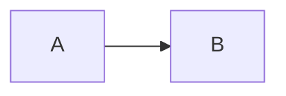

# Maintaining the roadmaps and course

```
pip install -r requirements.txt                 # once: markdown-it-py
python check_links.py beginner.md advanced.md   # verify every roadmap link -> link-report-*.tsv (gitignored),
                                                #   and report whether skills_pin has drifted behind upstream
python build.py                                 # roadmaps + course pages + search index
python build.py --pdf                           # ... plus roadmap PDFs
python build.py --strict                        # release build: any warning fails the build
python build.py --missing                       # ... and list every topic that has no lesson yet
```

Built files are not committed. They go to `--out DIR`, else the `AI_ACADEMY_OUT` environment variable, else `dist/`.
Point `AI_ACADEMY_OUT` at the shared folder learners open. Everything works when opened straight from disk.

`build.py` never goes online, because the course is opened over `file://`. The one check that needs the network —
whether upstream `copilot-studio-skills` has released past `skills_pin` — lives in `check_links.py`.

## Where content lives

| Source | Built page |
|---|---|
| `_source/<level>.md`: one roadmap per level; these own module and topic ids, titles, flags and links (format at the top of `build.py`) | `<level>.html` |
| `_source/course/scenario.md`: the Technik reference scenario, shared by every level | `course/scenario/index.html` |
| `_source/course/<module>/overview.md`: module overview (optional) | `course/<module>/index.html` |
| `_source/course/<module>/<topic-id>.md`: lesson body only; the title and "Go deeper" links come from the roadmap | `course/<module>/<topic-id>.html` |
| `_source/course/<module>/<topic-id>.pt-BR.md`: optional translation (may start with `---` / `title: …` / `---`) | `course/<module>/<topic-id>.pt-BR.html` |

Levels are ordered by `order:` in each roadmap's front matter, lowest first. Module ids and topic ids are each unique
across every level; module ids may contain hyphens (`how-copilot-works`), topic ids by convention do not
(`usingagents`). A lesson file must sit in the directory of the module that declares its topic.

A topic flagged `assumed` is a pointer, not a page: it reuses the id of a topic taught in a **lower** level, needs
no lesson, and links to wherever that topic is taught. Pointing at an unknown id, or at the same or a higher level,
fails the build.

Prev/Next stay within a level. A level whose front matter says `continues: yes` hands its last page on to the next
level's roadmap, where that level's assumed knowledge is listed.

The course is documentation only: there are no labs, exercises or environments to ship. Worked examples live inside lessons.

## Lesson syntax

Standard Markdown (tables and fenced code included), plus:

````
## TL;DR                       first heading of every full lesson (rendered as a highlighted box)

> [!TIP]                       callouts: NOTE, TIP, IMPORTANT, WARNING, CAUTION
> Text…



See {{topic:evalsets}} and the {{module:knowledge-and-rag}} module.
                               a link showing the target's current title. Never write a module or topic
                               id, path or level into prose by hand: these cannot go stale, only fail the
                               build. A target with no lesson yet links to its roadmap entry.

Written against {{skills-version}}. [Download]({{skills-release-url}})
                               the copilot-studio-skills release pinned by `skills_pin`

<!-- volatile verified=2026-09 -->
Anything that changes often: UI click-paths, preview features, pricing.
Learners see it as normal text; the build warns once it's older than 6 months.
<!-- /volatile -->

<!-- verified tenant=2026-09 -->
A claim checked in a live tenant. Learners see it as normal text; the date ages like volatile.
<!-- /verified -->

<!-- unknown since=2026-09 -->
A claim nobody has checked. Learners SEE this, as a "Not yet verified" callout.
The build lists every open one, and warns once it's older than 6 months.
<!-- /unknown -->
````

Every product claim is cited to Microsoft documentation, verified in a tenant, or marked unknown — never asserted
bare. Link macros are not expanded inside code, so the syntax can be shown; the pin macros are, so a command can use
the pinned version. The three markers each go on a line of their own, and `unknown` blocks do not nest.

Self-check questions use `<details><summary>…</summary>` so the answer is hidden until the reader
asks for it, and prints expanded. Raw HTML is allowed in lesson Markdown.

Every relative `<a href>` in the built pages is checked after the build; a link to a page that does
not exist is a warning, and fails a `--strict` release build. Only the file is checked, not the `#fragment`.
Links inside inline JavaScript are skipped, and `pdf/` links are only checked with `--pdf`.

Topics with no lesson yet are counted on every build and never fail it, `--strict` included.

Progress is stored in each browser's localStorage under `aiem:<topic-id>` and is shared by roadmap nodes, lessons
and assumed pointers, so a topic keeps its ticks when it moves level — keep topic ids stable. `progress.js` migrates
the old `aiem:<track>:<MODULE>-<topic>` keys once per browser; delete it a release or two after the re-cut ships.
Search covers lessons, overview pages, the scenario and every roadmap topic that doesn't have a lesson yet, each
result badged with its level.
PDF export uses a Playwright headless shell if installed, otherwise Edge/Chrome headless.
