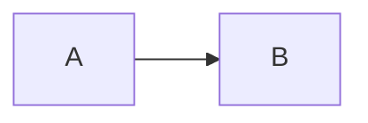

# Maintaining the roadmaps and course

```
pip install -r requirements.txt                 # once: markdown-it-py
python check_links.py beginner.md advanced.md   # verify every roadmap link -> link-report-*.tsv (gitignored)
python check_seed.py                            # verify the Snowflake seed data (no Snowflake account needed)
python build.py                                 # roadmaps + course pages + search index
python build.py --pdf                           # ... plus roadmap PDFs
python build.py --strict                        # release build: any warning fails the build
```

Built files are not committed. They go to `--out DIR`, else the `AI_ACADEMY_OUT` environment variable, else `dist/`.
Point `AI_ACADEMY_OUT` at the shared folder learners open. Everything works when opened straight from disk.

## Where content lives

| Source | Built page |
|---|---|
| `_source/beginner.md`, `_source/advanced.md`: roadmaps; these own topic ids, titles, flags and links (format at the top of `build.py`) | `beginner.html`, `advanced.html` |
| `_source/course/<SECTION>/module.md`: module overview (optional) | `course/<SECTION>/index.html` |
| `_source/course/<SECTION>/<topic-id>.md`: lesson body only; the title and "Go deeper" links come from the roadmap | `course/<SECTION>/<topic-id>.html` |
| `_source/course/<SECTION>/<topic-id>.pt-BR.md`: optional translation (may start with `---` / `title: …` / `---`) | `course/<SECTION>/<topic-id>.pt-BR.html` |
| `labs/<SECTION>/lab.md` or `exercise.md`; other files under `labs/` (zips, SQL) are copied as-is | `course/<SECTION>/lab.html`, `labs/…` |
| `labs/_setup/snowflake/`: the lab database — see its [README](../labs/_setup/snowflake/README.md) | copied to `labs/_setup/snowflake/` |

`.md` files under `labs/` become pages or, like the setup README, stay in the repository. Only the
non-Markdown files are copied to the build, so anything a learner needs must be in a lesson, a lab
page or a comment header inside the file itself.

## Lesson syntax

Standard Markdown (tables and fenced code included), plus:

````
## TL;DR                       first heading of every full lesson (rendered as a highlighted box)

> [!TIP]                       callouts: NOTE, TIP, IMPORTANT, WARNING, CAUTION
> Text…



<!-- volatile verified=2026-09 -->
Anything that changes often: UI click-paths, preview features, pricing.
Learners see it as normal text; the build warns once it's older than 6 months.
<!-- /volatile -->
````

Progress is stored in each browser's localStorage under `aiem:<track>:<topic-id>` and is shared by roadmap nodes and lessons, so keep topic ids stable.
Search covers lessons, module pages, labs and every roadmap topic that doesn't have a lesson yet.
PDF export uses a Playwright headless shell if installed, otherwise Edge/Chrome headless.
