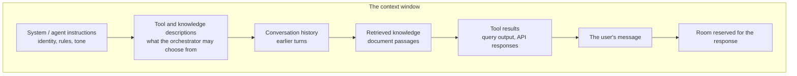

## TL;DR

The **context** is everything the model sees in one request: agent instructions, conversation
history, retrieved knowledge, tool results and the user's message. The **context window** is the
maximum number of tokens that will fit, counting input and output together. Two things follow, and
the second surprises people: content that does not fit has to be dropped or summarised, and quality
starts falling *well before* you reach the limit.

## Why it matters

An agent's behaviour is a function of its context. Change what goes in, and the answer changes;
nothing else about the model has moved. Almost every "the agent got worse" report is a context
problem: something important was pushed out, something irrelevant crowded in, or the useful material
ended up buried in the middle of a very long request.

This is also the one part of an agent you have complete control over. You cannot change how the
model reasons. You decide, entirely, what it reads.

## How it works

A request is assembled, in roughly this order, by whatever platform you are using:

Everything in that box competes for the same budget. The window is stated in tokens — 128,000 is a
common figure at the time of writing, and some models offer far more — but the number is the *total*,
so a large answer leaves less room for input.

Three properties matter more than the headline number.

**Quality degrades before the limit.** Models attend less reliably to material in the middle of a
long context than to material at the beginning or the end. A fact buried at position 60,000 of
100,000 is materially less likely to be used than the same fact at position 2,000. Filling the window
is not the same as using it.

**Overflow is handled by the platform, not by you, unless you decide otherwise.** When a
conversation exceeds the window, something has to go — usually the oldest turns. That is often fine
and occasionally catastrophic, when the dropped turn was the one where the user said which project
they meant.

**Irrelevant context actively hurts.** Adding a document that does not answer the question does not
leave the answer unchanged; it gives the model more plausible-looking material to be distracted by.
More context is not better context.

## In practice at Technik

Ana is a production planner. A realistic conversation with the Technik Production Assistant:

1. "Which work orders are late to start Coating this week?" — the agent runs a query, gets 14 rows.
2. "Only Plant 1." — nine rows.
3. "What is holding up the second one?" — the agent needs the work order number from turn 2's
   result, then looks up notifications.
4. "Draft a note to the supervisor."

By turn 4, the context holds the instructions, the tool descriptions, three question-and-answer
pairs, two full query results and the notification text. The agent is reading roughly six thousand
tokens to answer a five-word request — and turn 3 only works because turn 2's *result* is still
there. Drop it, and "the second one" refers to nothing.

Now make it go wrong in the two usual ways.

**Too much.** The query in turn 1 is written without a row limit and returns 400 work orders. The
result alone is around 25,000 tokens. Turn 2 re-sends it, turn 3 re-sends it again. The agent
becomes slow, expensive, and worse at turn 3 than it was at turn 1, because the useful fact is now
buried in the middle of a wall of rows.

**Too little.** The platform trims history to the last two turns. Ana's "only Plant 1" from turn 2 is
gone by turn 4, and the draft note quietly covers both plants. Nothing errors. The answer is simply
wrong, in a way that looks right.

> [!IMPORTANT]
> Both failures are invisible in the answer itself. This is why B5 teaches you to read the activity
> map, and why B13 evaluates multi-turn conversations rather than single questions.

## Design guidance

- **Budget deliberately.** Decide roughly how many tokens instructions, knowledge and tool results
  should each get, and design so none of them can grow without bound.
- **Put the important things at the edges.** Standing rules belong in the instructions at the top;
  the user's actual question is at the end. Do not bury a critical constraint in the middle of a long
  instruction block.
- **Cap every tool.** A tool that can return an arbitrary number of rows can destroy a context window
  on one call. Limit rows, select columns, aggregate before returning.
- **Retrieve, do not dump.** Three relevant passages beat a whole document, and are a tenth of the
  size.
- **Keep instructions short and structured.** Long instructions crowd out the material the answer
  actually needs. B2 covers how to write them; A2 covers budgeting them properly.
- **Start a new conversation for a new task.** It is the cheapest context management there is, and
  users will do it happily if you tell them why.

## Pitfalls

| Symptom | Cause | Fix |
|---|---|---|
| The agent "forgets" a constraint the user gave earlier | History was trimmed, or the constraint is buried mid-context | Restate constraints in the instructions; keep results small so history survives longer |
| Answers are good in short chats and poor in long ones | The window is filling and older content is being dropped | Trim or summarise history; encourage new conversations per task |
| Adding a second knowledge source made answers worse, not better | Irrelevant passages are crowding and distracting | Narrow the sources, or route between them (A8) |
| A long instruction block is partly ignored | Material in the middle of a long context is attended to least | Shorten. Move the critical rules to the start |
| Request fails with a token-limit error only sometimes | A tool occasionally returns far more data than usual | Cap the tool. Do not rely on typical result sizes |

## Key terms

**Context** — everything the model sees for one request.

**Context window** — the maximum tokens one request may use, input and output together.

**Truncation** — dropping content, usually the oldest turns, to fit the window.

**Context engineering** — deciding deliberately what goes into the window and what does not. A full
module in the Advanced track (A2).

**Grounding material** — the retrieved content placed in context so the model can answer from it
rather than from memory.
