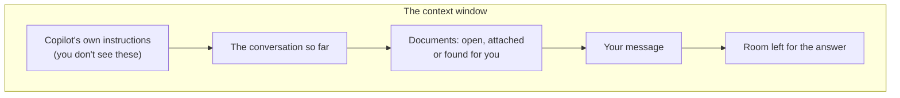

## TL;DR

The **context** is everything the model sees when it answers you: Copilot's own instructions, the
conversation so far, any documents that reached it, and your message. The **context window** is the
most it can take in at once. Two things follow, and the second surprises people: whatever does not
fit is dropped, and answers start getting worse *well before* the window is full.

## Why it matters

Copilot's answer depends on its context. Change what goes in, and the answer changes; nothing about
the model has moved. When Copilot seems to get worse partway through a chat, the cause is almost
always context: something important was pushed out, something irrelevant crowded in, or the useful
part got buried.

You don't control most of this. Copilot decides much of what the model reads. But what you attach
and what you say are yours, and they are what changes the answer.

## How it works

Each time you send a message, the model is given roughly this, in this order:

```mermaid
flowchart TB
  subgraph W["The context window"]
    A["Copilot's own instructions<br/>(you don't see these)"]
    B["The conversation so far"]
    C["Documents: open, attached<br/>or found for you"]
    D["Your message"]
    E["Room left for the answer"]
  end
  A --> B --> C --> D --> E
```

Everything in that box competes for the same space, the answer included. Three properties matter
more than how big the window is.

**Quality falls before the limit.** Models pay less reliable attention to the middle of a long context
than to its beginning or end. A fact buried halfway through a long document is less likely to be used
than the same fact near the top. Filling the window is not the same as using it.

**Overflow is handled for you.** When a conversation outgrows the window, something has to go, usually
the oldest turns. That is often fine, and occasionally it's the turn where you said which project you
meant.

**Irrelevant context hurts.** A document that does not answer the question doesn't leave the answer
unchanged. It gives the model more plausible-looking material to be distracted by. More is not better.

## In practice at Technik

A realistic chat with work instruction `SWI70000318` attached:

1. "Summarise the inspection steps."
2. "Only the ones before cladding."
3. "What does the second one require?" This only works if the answer to turn 2 is still there.
4. "Draft a note to the team about it."

Now make it go wrong in the two usual ways.

**Too much.** You attach five more documents "in case". The inspection steps are now a small island in
a much larger context, and the summary gets vaguer and starts mixing in steps from other procedures.

**Too little.** The chat has run long, and turn 2 has dropped out. The draft note quietly covers every
inspection step, not just the ones before cladding. Nothing errors. The answer is simply wrong, in a
way that looks right.

> [!IMPORTANT]
> Both failures are invisible in the answer itself. Check the answer against what you actually asked,
> especially late in a long chat.

## Design guidance

- **Start a new chat for a new task.** It is the simplest way to give the model a clean, relevant
  context.
- **Give it the right document, not every document.** One relevant file beats five possible ones.
- **Say what matters in your message.** If a constraint matters, such as *only Plant 1* or *only
  before cladding*, state it, and restate it if the chat has run long.
- **Put the key point first or last.** In a long request, don't bury it in the middle.

## Pitfalls

| Symptom | Cause | Fix |
|---|---|---|
| Copilot "forgets" something you said earlier | An earlier turn was dropped, or it is buried | Restate it; start a new chat for a new task |
| Answers are good early in a chat and poor later | The window is filling and older content is dropped | Start a new chat per task |
| Attaching more files made the answer worse | Irrelevant material is crowding and distracting | Attach only what answers the question |
| A long pasted request is partly ignored | The middle of a long context gets the least attention | Shorten it; put the key point first or last |

## Key terms

**Context**: everything the model sees when it answers.

**Context window**: the most the model can take in at once, the answer included.

**Truncation**: dropping content, usually the oldest turns, to fit the window.

**Grounding material**: documents placed in front of the model so it answers from them rather than
from memory.
