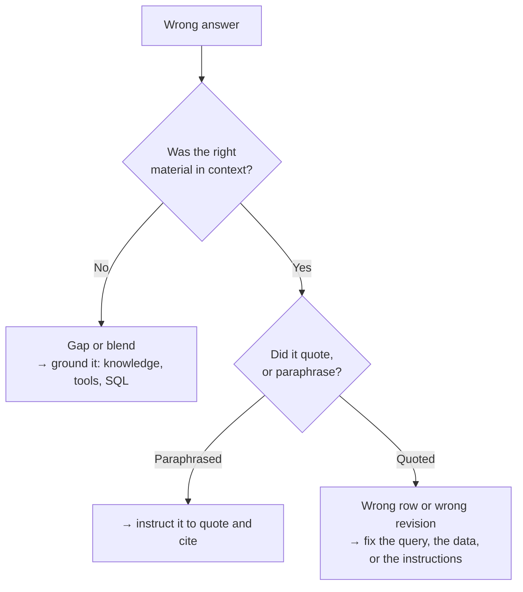

## TL;DR

A hallucination is a confident, fluent, wrong answer. It is not a malfunction: the model generates
what is *likely*, and a plausible-looking part number is likely. Prompting does not fix it, a better
model reduces it, and **grounding** — putting trusted content in the context and instructing the
model to answer only from it, with citations — changes the mechanism. This is the single most
important idea in the module, and the reason B6, B7 and B10 exist.

## Why it matters

An assistant that is right 95% of the time and visibly unsure the other 5% is useful. An assistant
that is right 95% of the time and *equally confident* in the remaining 5% is dangerous, because
there is nothing in the answer to tell the two apart. Fluency is not a signal of accuracy; they come
from the same mechanism.

At Technik the stakes are concrete. A machinist given the wrong CNC program revision cuts the wrong
part. An engineer given an invented acceptance criterion signs off a weld that should have been
rejected. These are not hypothetical costs, and "the AI said so" is not a defence.

## How it works

Three distinct mechanisms produce wrong answers, and they need different responses.

**1. Filling a gap.** The model was asked about something it has no information on. Nothing in its
training or its context covers Technik work order `100004521`, so it generates the most plausible
continuation — which has the right shape, the right vocabulary, and invented content. This is the
classic hallucination, and grounding is the fix.

**2. Blending.** The model has seen a great deal about a topic and merges sources. Asked about weld
overlay acceptance criteria it produces something that sounds like an industry standard, because it
is an average of many. It may be broadly right and specifically wrong — exactly the failure mode
that is hardest to catch.

**3. Misreading what it was given.** The material was there and the model used it incorrectly: took
the superseded revision instead of the released one, summarised where it should have quoted, or
carried a number from the wrong row. This one is *not* solved by more grounding; it needs clearer
instructions, cleaner data, or a tool doing the work instead of the model.

Diagnosing which you are looking at is the whole job:

**Grounding** means supplying trusted content in the request and telling the model to answer from it.
It works because it changes what is likely: with the real notification text sitting in the context,
reproducing it is far more probable than inventing one. It is not a guarantee — a grounded model can
still stray — which is why citations matter. A citation lets a human check in five seconds, and its
absence is itself a signal.

## In practice at Technik

Carla asks: *"Which CNC program revision should machining use for P7000001042?"*

**Ungrounded.** The model has never seen Technik's Teamcenter data. It answers "revision A", because
revision A is the most common thing to say about a revision. It is wrong — the released revision is
B, since `ECN70000051` — and there is nothing in the answer to suggest doubt.

**Grounded.** The agent calls a tool that queries `TC_CNC_PROGRAMS` for `P7000001042`, gets two rows
(A, superseded; B, released), and answers: "Revision B, released on *date*, superseded revision A
under `ECN70000051`." The answer is now a report of data, and every part of it is checkable. That
tool is the subject of B7.

**Grounded and still wrong.** The tool returns both rows and the instructions say "report the
revision". The model picks A — first row, no rule about which one matters. The material was right;
the instruction was ambiguous. Fixing this means either filtering in SQL (`RELEASE_STATUS =
'Released'`) or stating the rule explicitly. Prefer the SQL: a constraint enforced in the query is
enforced every time, and one written in a prompt is a strong suggestion.

That last case is the one worth remembering. The data was in the context and the answer was still
wrong, so grounding alone is necessary and not sufficient.

### Auditing an answer claim by claim

When an answer matters, check it the way a reviewer checks a drawing: one claim at a time, against
what the tools actually returned. Asked the same question, an agent replies:

> Machining should use CNC program `T7000000217` at **revision A** for part `P7000001042`. The
> program was updated under `ECN70000051`, *Update valve block machining datum scheme*, raised after
> first-article findings led to a fixture redesign. The change also updated drawing `DU700001042` to
> revision C and work instruction `SWI70000318` to revision C. Work order `100004510` is currently
> running this part and is using the correct revisions.

Its tools returned three things: `TC_CNC_PROGRAMS` rows for `T7000000217` (revision A *Superseded*,
revision B *Released*); `ECN70000051` with its affected items (part B→C, drawing `DU700001042` B→C,
program A→B); and work order `100004510` operation 0010, recorded on drawing revision B and program
revision A.

| Claim | Verdict | Mechanism |
|---|---|---|
| Use `T7000000217` for `P7000001042` | Supported | — |
| At revision A | **Contradicted** — A is superseded, B is released | Misreading: both rows were in context and it took the first |
| Updated under `ECN70000051`, for a fixture redesign | Supported | — |
| Drawing `DU700001042` went to revision C | Supported | — |
| `SWI70000318` went to revision C | **Unsupported** — not in this ECN's affected items at all | Blending: the document really is waiting on revision C, under a *different* ECN |
| Work order `100004510` uses the correct revisions | **Contradicted** — it is on superseded drawing and program revisions | Misreading: the agent had the work order's revisions and asserted the opposite |

The blended claim is the dangerous one. The revision error is checkable in seconds; the extra detail
about `SWI70000318` reads as helpful context and is the one a reviewer is least likely to question.
Two true facts were merged into a false one, and nothing in the retrieved data contradicts it loudly.

The answer the agent should have given:

> Machining should use `T7000000217` **revision B**, the released revision for `P7000001042`;
> revision A is superseded. It changed under `ECN70000051`, *Update valve block machining datum
> scheme*, which also took drawing `DU700001042` from revision B to C. Work order `100004510`
> operation 0010 is still on drawing revision B and program revision A — both superseded — so check
> the paperwork before machining starts. *Sources: `TC_CNC_PROGRAMS`, `TC_ECNS`,
> `TC_ECN_AFFECTED_ITEMS`, `SAP_WO_OPERATIONS`.*

Notice that the most valuable sentence is the warning nobody asked for. An agent that reports what the
paperwork says, without checking it against the released revision, gives a true answer to the wrong
question.

> [!IMPORTANT]
> The Technik data contains work orders sitting on superseded drawing revisions on purpose. An agent
> that reports the revision printed on the shop paperwork, without checking it against the released
> revision, is giving a true answer to the wrong question. That distinction is the heart of B7.

## Design guidance

- **Ground anything specific to your company.** Part numbers, statuses, dates, procedures, people. If
  the answer could differ between two companies, it must come from data.
- **Instruct explicitly: answer only from the provided sources; if they do not cover it, say so.**
  Models will follow this far more often than people expect, and "I could not find that" is a good
  answer.
- **Require citations** wherever a human might act on the answer. They make verification cheap and
  their absence conspicuous.
- **Filter in the query, not in the prompt.** "Only released revisions" as a `WHERE` clause is a
  guarantee; as a sentence in the instructions it is a preference.
- **Give the model less to choose between.** Two rows when one is correct is an invitation to pick
  wrong.
- **Test for it deliberately.** Include, in your evaluation set, questions whose honest answer is "I
  do not know" or "that does not exist" (B13). An agent that never says so is not safe, it is
  compliant.

## Pitfalls

| Symptom | Cause | Fix |
|---|---|---|
| Confident answers about data the agent has no access to | No grounding; the gap is being filled | Add the knowledge source or tool. No prompt wording substitutes |
| Plausible but wrong technical criteria | Blending of general training material | Ground in the company's own standards and require citations |
| Correct data retrieved, wrong value reported | Ambiguous instruction, or too many candidate rows | Filter in SQL; state the selection rule; return one row |
| Citations point at the right document but the wrong passage | Chunking or retrieval quality | Tune retrieval; see A8 |
| The agent never says "I do not know" | Nothing instructed it to, and the training bias is towards answering | Instruct it to, and test that it does |
| Answers degraded after adding a second source | More plausible material to blend | Narrow the sources or route between them |

## Key terms

**Hallucination** — fluent, confident output that is not supported by any source. A property of how
models generate, not a defect in a particular model.

**Grounding** — supplying trusted content in the request and instructing the model to answer from it.

**Retrieval-augmented generation (RAG)** — the pattern of finding relevant content and adding it to
the context before answering. The subject of B6 and A8.

**Citation** — a reference from a statement in the answer to the source it came from.

**Groundedness** — the degree to which an answer is supported by the supplied sources. Measurable,
and measured in B13 and A12.

**Abstention** — the model declining to answer when its sources do not cover the question. A feature,
and one you must ask for.
