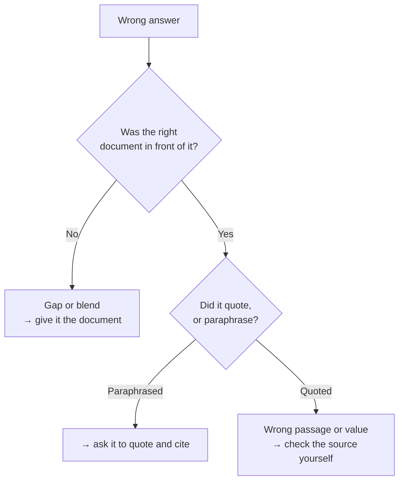

## TL;DR

A hallucination is a confident, fluent, wrong answer. It is not a malfunction: the model writes what is
*likely*, and a plausible-looking document number is likely. Rewording your question does not fix it,
and a better model only reduces it. **Grounding** changes the mechanism: you put trusted content in
front of the model and ask it to answer only from that, with citations.

## Why it matters

An assistant that is right 95% of the time and visibly unsure the other 5% is useful. One that is right
95% of the time and *equally confident* the other 5% is dangerous, because nothing in the answer tells
the two apart. Fluency is not a sign of accuracy. At Technik, an invented acceptance criterion gets a
weld signed off that should have been rejected, and "Copilot said so" is no defence.

## How it works

Three different mechanisms produce wrong answers.

**1. Filling a gap.** Nothing in front of the model covers what you asked. If it has never seen
`SOP70000101`, it writes the most plausible version: right shape, right vocabulary, invented content.
Grounding is the fix.

**2. Blending.** The model has seen a lot about a topic and merges it. Asked about weld overlay
acceptance criteria, it produces something that sounds like an industry standard, because it is an
average of many.

**3. Misreading.** The right document was there and the model used it wrongly: took the wrong row,
or summarised where it should have quoted. More documents don't fix this; asking it to quote the
passage, then checking, does.

```mermaid
flowchart TB
  A[Wrong answer] --> B{Was the right<br/>document in front of it?}
  B -- No --> C["Gap or blend<br/>→ give it the document"]
  B -- Yes --> D{Did it quote,<br/>or paraphrase?}
  D -- Paraphrased --> E["→ ask it to quote and cite"]
  D -- Quoted --> F["Wrong passage or value<br/>→ check the source yourself"]
```

Grounding works because it changes what is likely: with the real text in front of it, the model is far
more likely to reproduce it than invent. It is no guarantee. Citations let you check in seconds, and a
missing one is itself a warning.

## In practice at Technik

### Auditing an answer claim by claim

With work instruction `SWI70000318` attached, you ask: *"What does this require before a clad sealing
surface is released?"* Copilot replies:

> Inspect the clad surface visually and with a dye-penetrant test (section 5.2). Indications up to
> **1.5 mm** are acceptable. Record the results on the inspection sheet in **appendix B**. This is the
> current revision of the procedure.

Check it one claim at a time, against the document:

| Claim | Verdict | Mechanism |
|---|---|---|
| Visual and dye-penetrant inspection, section 5.2 | Supported | — |
| Up to 1.5 mm | **Contradicted**: 1.5 mm is the non-sealing table; sealing surfaces allow 0.8 mm | Misreading: both tables were there and it took the first |
| Results go in appendix B | **Unsupported**: the document has no appendix B | Blending: many work instructions have one |
| This is the current revision | **Unsupported**: the document cannot show that, and its cover shows a review date that has passed | Filling a gap |

The blended claim is the dangerous one: the wrong limit is caught by anyone who checks the table, but
the appendix reads as helpful detail, so it's the claim you are least likely to question.

The answer you wanted:

> For a sealing surface, section 5.2 requires a visual check and a dye-penetrant test, with
> indications up to **0.8 mm** (1.5 mm applies to non-sealing surfaces). Section 5.2 doesn't say
> where results are recorded. Its cover shows a review date that has passed, so confirm with the
> document owner that this revision is still the one to use. *Source: `SWI70000318`, section 5.2 and
> cover page.*

> [!IMPORTANT]
> The most valuable sentence is the warning nobody asked for. Some Technik documents are past their
> review date; an answer that misses that gives a true answer to the wrong question.

## Design guidance

- **Give it the source** for anything specific to Technik: document numbers, procedures, limits, dates.
- **Ask it to answer only from that source**, and to say so when the source doesn't cover the question.
  "I couldn't find that" is a good answer.
- **Ask for citations, and follow them** for anything you will act on.
- **Be most suspicious of detail you didn't ask for.**

## Pitfalls

| Symptom | Cause | Fix |
|---|---|---|
| A confident answer about a document Copilot never saw | Filling a gap | Give it the document |
| Plausible but wrong technical criteria | Blending general knowledge | Point it at Technik's own standard; ask for citations |
| Right document, wrong value | Misreading, often between similar values | Ask it to quote the passage, then check it |
| It never says "I don't know" | It is built to answer | Ask it to say when the source doesn't cover the question |

## Key terms

**Hallucination**: fluent, confident output that no source supports.

**Grounding**: putting trusted content in front of the model and asking it to answer from that.

**Citation**: a pointer from a statement in the answer to the source it came from.
