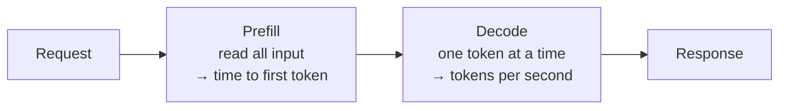

## TL;DR

Inference is the act of running a trained model to produce output. Your request is tokenised, read
in one pass, and then the response is generated one token at a time — which is why answers stream in
and why a long answer takes longer than a short one. Latency has two distinct parts: the wait before
the first word appears, driven mostly by how much you sent, and the speed of the words after that,
driven by how much is being generated. Knowing which half is slow tells you what to fix.

## Why it matters

"The agent is slow" is the second most common complaint about an internal assistant, after "the agent
is wrong". It is also the more tractable of the two, because latency decomposes cleanly and each
part has a different remedy. Adding a knowledge source, an extra tool call or a larger model each
slow things down in a different place, and the fix for one does nothing for the others.

Inference is also where the money goes. Nothing is billed until a request runs; then both what you
sent and what was produced are charged.

## How it works

A single request runs in two phases.

**Prefill.** The whole input — instructions, history, retrieved passages, tool results, the question
— is read and processed. This happens in one pass and is fast per token, but there can be a great
many tokens. Prefill dominates **time to first token**: the pause before anything appears.

**Decode.** The response is generated one token at a time, each token conditioned on everything
before it. This is inherently sequential, so it cannot be parallelised away. Decode speed is quoted
in tokens per second and determines how quickly the answer scrolls out.

So, roughly:

**total time ≈ (input size × prefill rate) + (output size × decode rate)**

Two more things shape what a user actually experiences.

**Streaming hides decode, not prefill.** Showing tokens as they arrive makes a slow answer feel
responsive. It does nothing for the silence at the start, which is exactly the part users interpret
as "broken".

**An agent turn is many inferences.** A single question that triggers a tool can easily be: one
inference to decide which tool to call, the tool call itself (a database round trip, not an
inference), and a second inference to write the answer from the result. Reasoning models add
internal thinking tokens, which are decoded like any others but never shown. A three-second answer
may contain two inferences, one query and several thousand invisible tokens.

## In practice at Technik

Diego asks: *"What was machining efficiency last month, by work centre?"*

| Step | What happens | Typical contribution |
|---|---|---|
| 1 | The agent reads instructions, tool descriptions and the question, and decides to call the Snowflake tool | Prefill over ~2,000 tokens, then a short decode to emit the tool call |
| 2 | The query runs in Snowflake | Not inference at all — warehouse resume plus query time |
| 3 | The agent reads the question, the tool description, the result rows and the history, then writes the answer | Prefill over ~4,000 tokens, decode of ~250 tokens |

Three separate things can make this feel slow, and they need three different fixes:

- **Step 2 is slow** because the XSMALL warehouse was suspended and had to resume. That is a
  Snowflake problem, not a model problem, and no amount of prompt tuning touches it.
- **Step 3's prefill is slow** because the query returned 300 rows instead of an aggregate. Fix it in
  SQL: `GROUP BY` in the database, not in the model.
- **Step 3's decode is slow** because the instructions ask for a detailed narrative per work centre.
  Fix it by asking for a compact table.

> [!TIP]
> When someone says an agent is slow, ask: *slow to start, or slow to finish?* The first is prefill —
> you are sending too much. The second is decode — you are asking for too much. They are rarely the
> same problem.

## Design guidance

- **Measure the parts, not the total.** Time to first token and total time tell you different things.
  Copilot Studio's activity map shows you where a turn spent its time; use it before guessing.
- **Cut input to cut the wait.** Fewer retrieved passages, smaller tool results, shorter history.
- **Cut output to cut the tail.** Ask for a table rather than prose, a summary rather than a
  transcript, three bullets rather than "a thorough explanation".
- **Do not use a reasoning model for a lookup.** Reasoning models spend tokens thinking before they
  answer. That is worth it for a genuinely hard decision and pure waste for "what is the status of
  work order 100004521".
- **Separate tool latency from model latency** before optimising either. A warehouse that takes eight
  seconds to resume will not be fixed by changing model.
- **Tell the user something is happening.** A progress message during a long tool call costs nothing
  and changes the experience completely.

## Pitfalls

| Symptom | Cause | Fix |
|---|---|---|
| Long silence, then the answer arrives quickly | Prefill — a large input | Shrink retrieved passages, tool results and history |
| The answer starts immediately but takes ages to finish | Decode — a long response | Ask for less output; specify a format and a length |
| Occasional very slow turns, most are fine | A tool call that sometimes returns much more data, or a cold warehouse | Cap tool results; check the tool's own timings separately |
| A reasoning model is slower than expected on simple questions | Thinking tokens are being generated and billed but not displayed | Use a smaller or non-reasoning model for routine lookups (B5) |
| Latency got worse after adding knowledge, with no quality gain | Passages are being retrieved and read for every question, including ones that do not need them | Route: only search knowledge when the question calls for it (A8) |

## Key terms

**Inference** — one run of a trained model over an input to produce an output.

**Prefill** — the phase that reads the input. Drives time to first token.

**Decode** — the phase that generates the output, one token at a time.

**Time to first token (TTFT)** — how long the user waits before anything appears.

**Streaming** — sending tokens to the client as they are produced rather than waiting for the whole
response.

**Reasoning tokens** — tokens a reasoning model generates while working out its answer. Billed,
timed, usually not shown.
