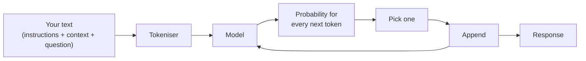

## TL;DR

A large language model is a neural network trained on an enormous amount of text to do one thing:
given a sequence of text, predict what comes next. Everything else — answering questions,
summarising a work instruction, drafting a quality notification, writing SQL — is that one ability,
applied. It has no database, no memory between requests, and no way of knowing whether what it
produces is true. What it has is an extraordinarily good sense of what *sounds* right, which is
enough to be useful and exactly why it needs engineering around it.

## Why it matters

Nearly every surprising thing an agent does follows from next-token prediction:

- It answers differently the second time, because prediction is probabilistic.
- It invents a plausible part number, because a plausible part number is what comes next.
- It forgets what you said twenty messages ago, because nothing persists unless you resend it.
- It gets better when you show it an example, because examples change what is likely to come next.

If you hold "it predicts the next chunk of text" in mind, none of those are mysterious, and each has
an obvious engineering response. If you think of the model as a knowledgeable colleague who looks
things up, all four are baffling.

## How it works

**Training.** The model is shown vast quantities of text and repeatedly asked to predict a hidden
next piece. Each time it is wrong, its internal parameters are nudged. Do this billions of times
over a large fraction of the public internet, books and code, and the parameters end up encoding an
enormous amount of statistical structure about language — including, incidentally, a great deal of
information about the world, because text is about the world.

**Instruction tuning.** A raw predictor continues text; it does not answer questions. A second
training stage, using examples of instructions and good responses, together with feedback on which
responses people prefer, turns a text continuer into something that behaves like an assistant. This
is why the model responds to "summarise this" rather than continuing your sentence.

**Generation.** At request time, your text is split into tokens (see [Tokens](tokens.html)), and the
model computes a probability for every possible next token. One is chosen, appended to the
sequence, and the whole thing runs again for the token after that. The answer is built one token at
a time, left to right, which is why responses stream in and why longer answers take longer.

Three consequences of that loop are worth stating plainly.

**The model is stateless.** It does not remember your last message. A chat feels continuous only
because the application resends the conversation each time. Memory, in every product you will use,
is something built *around* the model.

**Knowledge is frozen and fuzzy.** Whatever was in the training data is baked into the parameters,
approximately, as of a cut-off date. The model has no access to Technik's Snowflake tables, and no
way to distinguish something it "knows" well from something it half-absorbed from one bad web page.

**There is no fact-checking step.** Fluency and accuracy are produced by the same mechanism. A
confident, well-formatted, completely wrong answer costs the model no more effort than a right one.

## In practice at Technik

Consider Bruno asking: *"Summarise quality notification 300001233."*

A bare model can produce a beautifully structured summary of a quality notification. It cannot
produce a summary of *that* notification, because it has never seen Technik's SAP data. What it will
do instead is generate a plausible one — right format, right vocabulary, invented content.

Everything the Technik Production Assistant does is therefore a variation on the same move: **put
the real material in front of the model, then ask.** The work instruction text, the notification
row, the Teamcenter revision record — all of it arrives as text in the request, and all of it comes
from somewhere the model cannot reach on its own. B6 does that with documents, B7 with tools and
connectors, B10 with SQL. The model's job is to read and write well. Getting it the right material
is yours.

> [!NOTE]
> This is also why "which model is best" is usually the wrong first question. An excellent model
> given no data will confidently invent; an ordinary model given the right row will read it back
> correctly. Data plumbing beats model choice far more often than the other way round.

## Design guidance

- **Assume nothing persists.** If the model needs to know something, put it in the request. Design
  for that from the start rather than discovering it when a conversation gets long.
- **Treat model knowledge as background, not as source.** It is excellent for language, structure,
  general engineering vocabulary and code. It is not a source for anything specific to your company
  — a part number, a procedure, a status, a date.
- **Separate "does it read well" from "is it right".** They are different failure modes with
  different fixes, and the model gives you no signal about which one you are looking at.
- **Expect variation and design for it.** Anything that must give the same answer every time needs
  either a low-variance setting, a deterministic tool doing the actual work, or both.

## Pitfalls

| Symptom | Cause | Fix |
|---|---|---|
| The agent answers questions about company data confidently, but the details are wrong | It has no data source; it is generating plausible text | Ground it — knowledge sources (B6) or tools (B7). No prompt wording fixes this |
| "It remembered yesterday's conversation" — or, more often, it did not | The application is or is not resending history; the model itself never remembers | Check what the platform actually sends. Design memory explicitly |
| Answers get worse the longer a conversation runs | History is being truncated, or the useful content is buried | See [Context & Context Window](context.html) |
| The same question gives different answers in testing | Sampling; this is normal behaviour, not a fault | Lower the temperature for repeatable tasks, and evaluate over a test set rather than single runs (B13) |
| The model contradicts itself inside one answer | Each token is chosen locally; nothing enforces global consistency | Ask for shorter, more structured output; give it the facts rather than asking it to recall them |

## Key terms

**Large language model (LLM)** — a neural network trained to predict the next token in a sequence,
large enough that doing so produces broadly useful language ability.

**Parameters** — the numbers inside the model that training adjusts. Model size is usually quoted as
a parameter count; more parameters generally means more capable, slower and more expensive.

**Pre-training** — the first stage, learning language from a very large unlabelled corpus.

**Instruction tuning** — the later stage that makes a text predictor behave like an assistant.

**Stateless** — the model retains nothing between requests. Any continuity is supplied by the
application.

**Training cut-off** — the point after which the model has seen nothing. Anything later is either
unknown to it or must be supplied in the request.

**Grounding** — supplying trusted content in the request so the model answers from it rather than
from its parameters. The subject of [Hallucinations & Grounding](hallucination.html) and of B6.
