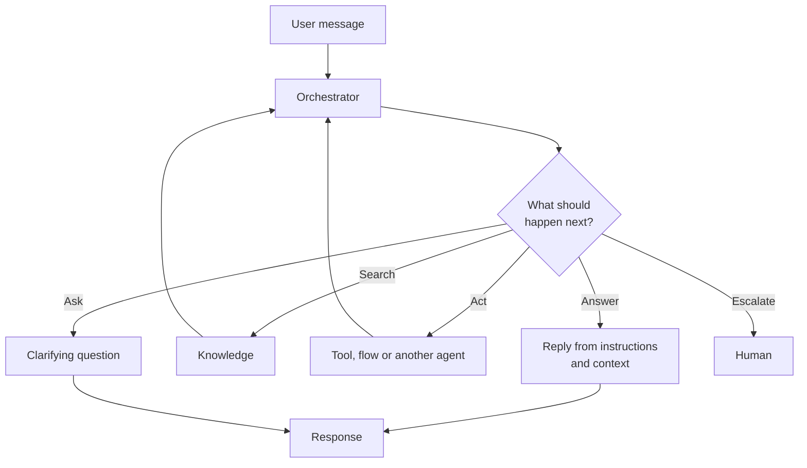

## TL;DR

An agent is a model, plus instructions, plus knowledge and tools, plus a **loop that decides what to
do next**. It can answer, search, call a system, run an automation, ask a clarifying question, or
hand over to a person — and it chooses which, each turn, within the limits you set. A chatbot
follows a path you drew. An agent picks its own, which is why it covers requests you never
anticipated and why you cannot fully enumerate what it will do.

## Why it matters

The word is used for everything, which makes it useless as a specification. What is not vague is the
consequence: once something decides its own next step, the questions that matter change.

- With a workflow you ask *"is the logic right?"*
- With an agent you ask *"what could it decide to do, and what is the worst of those?"*

That second question is the origin of least-privilege tool identities (B7), of approvals (B9), of
moderation and injection handling (B11), and of evaluation (B13). All of it follows from the loop.

## How it works

The parts:

| Part | Is |
|---|---|
| **Model** | The language ability. Reads, writes, decides |
| **Instructions** | Identity, scope, rules, tone. Read every turn (B5) |
| **Knowledge** | Content it can retrieve from (B6) |
| **Tools** | Things it can do (B7) |
| **Skills** | Written procedures for kinds of task, on harnesses that support them (B8) |
| **Orchestrator** | The thing that decides. The subject of [Orchestration](orchestration.html) |
| **Harness** | The runtime all of this sits in ([What Is a Harness](harness.html)) |

Three properties follow, and each one surprises somebody:

**It is not deterministic.** The same question can take a different route twice. Anything that must
be identical every time belongs in a flow or a query, not in the agent's judgement.

**Its reach is exactly its tools.** An agent cannot do anything it has no tool for, and it can do
anything it has a tool for. There is no middle ground and no instruction that creates one.

**It is only as good as what it is given.** The loop is the same in a useless agent and an excellent
one. The difference is the instructions, the knowledge, the tools and their descriptions.

### Agent, chatbot, workflow

| | Decides its next step | Handles the unanticipated | Predictable |
|---|---|---|---|
| **Chatbot** | No — you drew the path | No | Yes |
| **Workflow** | No — you wrote the logic | No | Yes |
| **Agent** | Yes | Yes | No, not fully |

None of these is better. Real systems use all three, and the skill is putting each where it belongs
— which is what B8's [Skills vs. Topics vs. Tools](../B8/skillsvs.html) is about, and what this
module's exercise makes you practise.

## In practice at Technik

The Technik Production Assistant is an agent because its users will not stay on a path.

Ana starts with "which work orders are late to start Coating this week?", narrows to Plant 1, points
at one of them, asks what is holding it up, and asks for a note to the supervisor. Nobody drew that
path. A chatbot would need every branch enumerated; the agent needs a query tool, notification data,
and instructions about what to do when something is blocked.

But look at what is *not* left to judgement, because this is the part people get wrong:

| Part of that conversation | Mechanism | Why not judgement |
|---|---|---|
| Capturing and validating a work order number | **Topic** (B5) | The format check must happen every time |
| The query behind "late to start Coating" | **Tool over a view** (B7, B10) | The definition of "late" must not vary |
| Which document governs an acceptance criterion | **Instruction** (B6) | Source precedence is a rule, not a preference |
| Creating a record in SAP | **Flow with approval** (B9) | Irreversible |

The agent decides *what to do*. It does not decide *what the numbers mean*. Keeping that line clear
is most of what separates an assistant people trust from one they check by hand.

> [!TIP]
> When someone proposes "an agent for X", ask what it would be allowed to *do*, not what it would be
> able to answer. The tool list is the design; everything else is wrapping.

## Design guidance

- **Give it the smallest set of tools that covers the job.** Reach is exactly the tool list.
- **Write descriptions as carefully as instructions.** They are what the loop decides with.
- **Put anything that must be identical every time outside the agent's judgement.**
- **Assume it will be asked things you did not plan for.** That is the reason you chose an agent.
- **Design the failure case.** What it says when it cannot help is part of the product.
- **Decide early what it may do without asking**, and build the confirmation
  ([Human-in-the-Loop](hitl.html)).

## Pitfalls

| Symptom | Cause | Fix |
|---|---|---|
| Inconsistent answers to the same question | It is an agent; the route varies | Move the part that must be consistent into a tool, view or flow |
| "It should just know that" | The knowledge or tool does not exist | Reach is exactly what you gave it |
| It does something nobody wanted | A tool existed for it | Remove the tool, or gate it behind a confirmation |
| Impossible to say what it will do | That is the nature of the loop | Constrain with tools and evaluate with a fixed set (B13) |
| Built as an agent, behaves like a bad chatbot | Everything was forced into topics | Let the orchestrator do its job; keep topics for what must be scripted |
| Built as an agent, should have been a flow | The task never needed judgement | A flow. Cheaper, testable, auditable (B9) |

## Key terms

**Agent** — model, instructions, knowledge and tools, plus a loop that decides the next step.

**Orchestrator** — the component that makes that decision ([Orchestration](orchestration.html)).

**Harness** — the runtime the whole thing runs in ([What Is a Harness](harness.html)).

**Tool** — something the agent can do. Its reach (B7).

**Autonomous agent** — one started by an event rather than a person
([Conversational vs. Autonomous](autonomous.html)).
