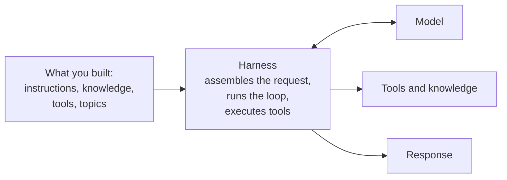

## TL;DR

A harness is the runtime between what you build and the model. It decides when the model is called,
what is sent, how the reply is read, which tools may run and what happens when one fails. The same
model in two harnesses behaves differently — sometimes very differently — which is why "which model
are you using?" is rarely the most useful question about an agent.

## Why it matters

People attribute agent behaviour to the model because the model is the part with a name. But between
your instructions and the model sits a layer making dozens of decisions you did not make: how much
history to send, how to describe your tools, how many steps to allow, what to do when a tool errors,
whether to retry.

Understanding that layer exists is what turns "the model is bad at this" into a question you can
actually investigate.

## How it works

Every agent platform has one, named or not. A harness:

| Decides | Which means |
|---|---|
| What goes into the request | Which history, how much, which passages, in what order |
| How tools are presented | The format and wording the model sees, built from your descriptions |
| When to call the model | Once, or in a loop with tool calls in between |
| How to read the reply | Recognising a tool call, an answer, a request for clarification |
| Which tools may run, and how often | Step limits, retries, loop protection |
| What happens on failure | Retry, surface, abandon |
| What is remembered | Between turns, and between conversations |

Three consequences worth holding on to.

**Identical inputs, different behaviour.** Two harnesses given the same instructions and the same
model will send different requests, because they assemble context differently. Differences in
verbosity, in tool-calling eagerness, in willingness to take several steps are usually the harness,
not the model.

**The harness sets the ceiling on multi-step work.** An agent that can take ten steps can do things
one that stops after two cannot, regardless of model.

**You mostly cannot see it.** In a low-code platform the harness's decisions are not exposed. This is
a reasonable trade — it is a great deal of work you did not have to do — and it is why the activity
map matters so much: it is the one window into what the harness actually did.

### Why this is worth knowing in a low-code course

Two reasons beyond curiosity.

It explains the constraints. Topics exist in one Copilot Studio harness and skills in another, not
arbitrarily but because they are different runtimes with different loops. [Choosing a
Harness](chooseharness.html) is a real architectural decision for exactly this reason.

And it is what the Advanced track opens up. A7 rebuilds the Technik assistant in Microsoft Agent
Framework, where you write the loop yourself. Everything a harness decides silently becomes a line
of your code — which is more control, more work, and a much clearer view of what was happening all
along.

## In practice at Technik

Consider one Technik question under two harnesses, same model, same instructions:

> *"Which CNC program revision should machining use for `P7000001042`, and is work order `100004510`
> using it?"*

Answering it properly takes two tool calls and a comparison. Whether that happens depends on harness
decisions you did not make:

| Harness decision | If it goes one way | If it goes the other |
|---|---|---|
| How many steps are allowed in a turn | Both calls, then a combined answer | One call, then an answer about revisions only |
| Whether tool results stay in context | The comparison is possible | The second call cannot see the first result |
| What happens when a tool errors | Says so, or retries | Silently answers from what it has |
| How tool descriptions are presented | Exclusions are honoured | Exclusions are weakened |

None of that is the model's doing, and none of it is visible in the answer. When an agent
inexplicably does half a job, the harness is a better first suspect than the model.

> [!TIP]
> When comparing two platforms, do not compare their models — they often offer the same ones.
> Compare what their harnesses do: how many steps, what stays in context, what happens on failure.
> That is where the behaviour you will actually experience comes from.

## Design guidance

- **Attribute behaviour carefully.** Harness, context, tools, then model.
- **Read the activity map** rather than inferring from answers.
- **Do not assume multi-step work will happen.** Test a question that needs two calls, early.
- **Expect prompts not to port.** Instructions tuned in one harness need re-tuning in another.
- **Learn the harness's limits** — step counts, context handling, failure behaviour — before
  designing something that depends on them.
- **When you need control over the loop, that is a pro-code signal** (A7), not a reason to fight the
  platform.

## Pitfalls

| Symptom | Cause | Fix |
|---|---|---|
| The agent does half a multi-step job | A step limit, or results not kept in context | Check the activity map; split the work; consider a flow |
| The same prompt behaves differently on another platform | Different harness | Re-tune. There is no portable prompt |
| A tool failed and the answer did not say so | The harness swallowed it | Check the activity map; design the failure message |
| Blaming the model for tool-calling behaviour | It is largely harness-determined | Investigate the harness first |
| A design assumes memory between conversations | The harness may not provide it | Check what is actually retained |
| Hitting a wall on complex orchestration | The harness's ceiling | That is the pro-code boundary (A7) |

## Key terms

**Harness** — the runtime between what you build and the model.

**Agent loop** — call the model, act, read the result, decide again.

**Step limit** — how many actions a harness allows in one turn.

**Activity map** — the record of what happened in a turn. The window into the harness (B5).

**Agent Framework** — Microsoft's pro-code option, where you write the loop yourself (A7).
