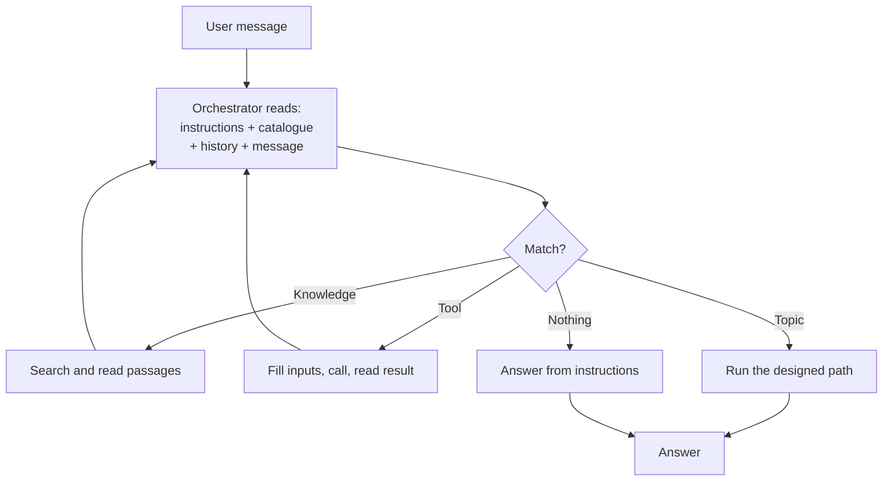

## TL;DR

Orchestration is how an agent decides what to do with a request: which knowledge to search, which
tool or topic to use, whether to ask a question, and how to combine what comes back. With
**generative orchestration** the model makes that choice by reading the **names and descriptions**
you wrote. That is why descriptions are the highest-leverage text in the whole product, and why "the
agent won't use my tool" is almost always a writing problem.

## Why it matters

Everything an agent does passes through this decision. An excellent tool that is never chosen is
worth nothing; a vague description that matches everything makes the agent worse at the things it
used to do well.

It also explains a pattern you will meet repeatedly: adding a capability degrades the ones already
there. Nothing broke. The decision just got harder.

## How it works

Each turn the orchestrator sees:

- the instructions;
- a catalogue: every tool, skill, knowledge source and topic, by **name and description**;
- the conversation so far;
- the user's message.

From that it decides. It may call something, read the result, and decide again — several times
before answering.

### Why descriptions are the logic

The orchestrator has no access to what a tool *does* — only to what you said it does. So:

> **Name:** `Run query` · **Description:** Runs a query against the database.

is unroutable. Nothing in it matches "which revision should machining use?".

> **Name:** `Get released revision` · **Description:** Returns the current released revision of a
> part, drawing, controlled document or CNC program from Teamcenter, with the date and the ECN that
> introduced it. Use when the user asks which revision to use, whether something is up to date, or
> about revision history. Do not use for work order status.

is routable: it says what comes back, which words signal a match, and what it is not for.

The final clause matters more as the catalogue grows. Exclusions are how six tools stay distinct.

### Generative versus classic

<!-- volatile verified=2026-09 -->
Copilot Studio can orchestrate generatively — the model chooses — or follow classic trigger-phrase
matching for topics. Which is available, how they interact, and where the setting lives differ by
harness and change between releases. Check the linked documentation before relying on specific
behaviour.
<!-- /volatile -->

Generative orchestration covers requests nobody enumerated, at the cost of being unable to say in
advance exactly what will happen. Classic matching is predictable and only covers what you listed.
Most real agents want generative orchestration with topics for the few paths that must be exact —
which is precisely the Technik design.

### The catalogue gets harder as it grows

Six well-described tools route well. Twenty overlapping ones route badly, and the failure is gradual:
slightly more wrong choices, on requests that used to work. The responses, in order of cost: sharpen
descriptions, add exclusions, merge or remove overlapping entries, and finally split the agent
(B7's [connected agents](../B7/connected.html)).

## In practice at Technik

By the end of the Beginner track the assistant's catalogue holds a topic, several tools, three
knowledge sources and a connected agent. A single question exercises most of the decision:

> *"Which CNC program revision should machining use for `P7000001042`, and is work order `100004510`
> using it?"*

The orchestrator has to call the revision tool, then reach work order data, then combine the two —
and **not** reach for the notification tool, the documents, or the write-up agent, all of which are
about parts and operations too.

What makes that work is entirely text you wrote:

| Entry | The clause doing the work |
|---|---|
| `Get released revision` | "Use when the user asks which revision to use… **Do not use for work order status**" |
| Snowflake work order knowledge | Names the tables and what they hold |
| `Find quality notifications` | "**Do not use to draft** or to change a notification" |
| QN write-up agent | "Hand over when the user has found a defect and wants it written up" |

Four exclusion clauses. Remove them and the same agent, with the same model and the same data, gets
noticeably worse — which is the most useful thing to know about orchestration.

> [!TIP]
> After adding anything to the catalogue, re-run the routing tests for everything already there. The
> new entry is not the only thing that changed; the decision changed for all of them.

## Design guidance

- **Write descriptions from real user phrasing**, not from the feature name.
- **Always say what an entry is not for.** Exclusions do more work than descriptions as you scale.
- **One entry per capability.** Overlap is the main cause of misrouting.
- **Keep the catalogue small.** Remove what nobody uses.
- **Use topics only where the path must be exact.** Everything else, let the orchestrator work.
- **Test routing separately from output**, with should-trigger and should-not lists.
- **Read the activity map.** It tells you what was chosen and why (B5).

## Pitfalls

| Symptom | Cause | Fix |
|---|---|---|
| A tool is never used | The description does not match how people ask | Rewrite from real requests |
| The wrong tool is used | Two descriptions overlap | Add exclusions; merge or remove |
| Adding a tool made others worse | The decision got harder | Sharpen, prune, or split the agent |
| It answers instead of searching | Nothing in the catalogue matched | Better descriptions, or the source is not enabled |
| It calls tools in a strange order | Multi-step routing with no guidance | State the order in the instructions, or wrap it in a flow |
| Behaviour changed after a model change | Models differ in how they route | Re-test routing, not just answers (B5) |

## Key terms

**Orchestration** — deciding what the agent does with a request.

**Generative orchestration** — the model choosing, from names and descriptions.

**Catalogue** — everything the orchestrator may choose from: tools, skills, knowledge, topics.

**Exclusion clause** — "do not use for…". The highest-value sentence in a description.

**Activity map** — the record of what was chosen in a turn (B5).

**Routing test** — should-trigger and should-not-trigger questions, run before checking output.
