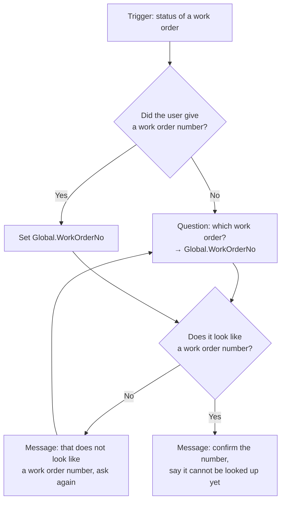

## TL;DR

In the standard harness, a **topic** is a conversation path you design node by node: messages,
questions, conditions, variables and actions. It starts from **trigger phrases** or from the
orchestrator deciding it fits. Use a topic when the exchange must run exactly as drawn — a
structured intake, a compliance check, a confirmation before something irreversible. Everywhere
else, let the orchestrator work from instructions, knowledge and tools.

## Why it matters

Topics are the standard harness's guarantee. Instructions influence; a topic *runs*. When Technik
needs a work order number captured, validated and confirmed before anything happens, a topic is how
you know it happened.

They are also the most over-used feature in Copilot Studio. Every question that an agent answers
inconsistently looks like a candidate for a topic, and building one is how a flexible agent becomes
a phone menu.

## How it works

A topic is a flow of nodes:

| Node | Does |
|---|---|
| **Trigger** | Phrases, or orchestration, that start the topic |
| **Message** | Says something |
| **Question** | Asks, and stores the answer in a variable |
| **Condition** | Branches on a value |
| **Action** | Calls a tool, a flow or a prompt |
| **Redirect** | Hands over to another topic |

### Trigger phrases

Five to ten realistic phrasings, written the way users actually type — including the terse ones.
"Status of 100004521" is a real message; "Could you please tell me the status of work order
100004521?" is what people write in examples and not in Teams.

With generative orchestration the trigger phrases are guidance rather than a fixed list: the model
matches intent, so the phrases teach it what the topic is for. Overlapping phrases between two
topics is how the wrong one fires.

<!-- volatile verified=2026-09 -->
How trigger phrases interact with generative orchestration, and whether a topic can be reached only
by orchestration, has changed between releases. Check the linked documentation for current
behaviour.
<!-- /volatile -->

### System topics

Copilot Studio ships topics for conversation start, escalation, fallback and end. The **fallback**
topic — what happens when nothing matched — is worth reading early: it is where users end up when
your agent does not understand, and its default wording is rarely what you want.

### When a topic is the wrong answer

If the topic is mostly conditions, it is a flow wearing a topic's clothes; move it to an agent flow
(B9) and call it. If it is mostly messages, it is documentation; put it in knowledge. If it needs to
handle phrasing you cannot enumerate, it is the orchestrator's job, not yours.

## In practice at Technik

The *Work order status* topic, built in this module's lab:

Right now the last node is an apology. In B6 the agent gains work order knowledge and in B7 its
first tool, and what the topic does with `Global.WorkOrderNo` becomes real. The topic itself barely
changes — which is the point of building it now.

Three decisions in that small topic are worth naming:

**It validates the format.** `100004521` is nine digits; `P7000001042` is a part number someone typed
in the wrong field. Catching that here means every later capability can trust the variable. Format
validation is exactly the sort of guarantee a topic gives you and an instruction does not.

**It stores in a global variable.** Ana will ask follow-up questions about the same work order, and
they should not each re-ask for the number.

**It says plainly what it cannot do.** The honest apology is better than a plausible answer, and it
is the same abstention posture the instructions set in B5 and B6 make load-bearing.

What is deliberately *not* a topic: "what does `SWI70000318` say about porosity?" There is no path to
draw. That is knowledge, and forcing it into a topic would give you a worse answer and a maintenance
burden.

> [!TIP]
> Write the trigger phrases by reading real messages, not by imagining them. If you have no real
> messages yet, write five and then delete every "please" and "could you" — that gets you closer.

## Design guidance

- **Build a topic when the path must be identical every time.** Not when answers are inconsistent —
  that is usually an instructions or description problem.
- **Validate captured values inside the topic.** It is the one place you can guarantee it.
- **Use global variables for things that span the conversation**, topic variables for the rest.
- **Keep topics short.** Many conditions means it should be a flow.
- **Do not let two topics share trigger phrases.**
- **Customise the fallback topic.** It is your agent's worst moment; do not leave it generic.
- **Say what the agent cannot do**, plainly, rather than deflecting.

## Pitfalls

| Symptom | Cause | Fix |
|---|---|---|
| The wrong topic fires | Overlapping trigger phrases or descriptions | Make the boundaries explicit; delete duplicated phrases |
| A topic never fires | Phrases do not match how people type | Rewrite from real messages |
| Users get stuck in a loop | A question re-asks with no escape | Add an attempt limit and a way out |
| A topic has grown twenty conditions | It is a flow | Move it to an agent flow and call it (B9) |
| The agent asks again for something it was already told | The value was stored in a topic variable | Use a global variable |
| Garbage reaches a later step | No validation at capture | Validate in the topic; this is what it is for |
| The fallback message embarrasses you in a demo | It was never customised | Rewrite it |

## Key terms

**Topic** — a designed conversation path. Standard harness only.

**Trigger phrase** — an example of what a user says to start a topic.

**Node** — one step: message, question, condition, action, redirect.

**System topic** — a built-in topic such as conversation start, fallback or escalation.

**Fallback** — what happens when nothing matched.

**Global variable** — a value shared across topics for the conversation
([Variables & Power Fx](variables.html)).
