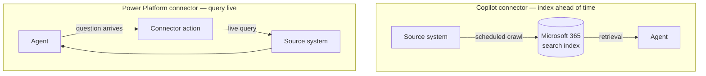

## TL;DR

Two things in Copilot Studio are both called connectors and both bring in knowledge, and they work
in opposite ways. **Copilot connectors** (formerly Graph connectors) *index external content into
Microsoft 365 ahead of time*, so it is searched like any other Microsoft 365 content. **Power
Platform connectors used as knowledge** *query the source system live*, at the moment the question
is asked. Freshness and permissions fall out differently, and so does what happens when the source
is slow or down.

## Why it matters

Choosing the wrong one produces an agent that works and is subtly wrong. Index content that changes
hourly and answers lag reality. Query a system live for content that barely changes and every
question pays a round trip, every outage is your outage, and you have built a dependency you did not
need.

The names do not help. "Connector" means two different things one menu apart, and the word appears
in both. Knowing which is which is most of this lesson.

## How it works

| | Copilot connector | Power Platform connector as knowledge |
|---|---|---|
| When the content is read | Ahead of time, on a schedule | At the moment of the question |
| Freshness | As fresh as the last crawl | Live |
| Permissions | Mapped into the index at crawl time | Whatever the connection uses |
| Latency | Fast — it is a search index | A round trip to the source, every time |
| If the source is down | Answers still work, from the index | No answer |
| Scale | Large corpora, indexed once | Bounded result sets, per question |
| Best for | Documents, tickets, wikis, knowledge bases | Records, statuses, metrics, anything transactional |

<!-- volatile verified=2026-09 -->
Which connectors are available in each form, how permissions are mapped for indexed content, and
where each is configured all change between releases — and Copilot connectors in particular have
been renamed once already. Check the linked documentation for the current state before designing
around a specific behaviour.
<!-- /volatile -->

### The permission question

This is where the two genuinely diverge.

A **Copilot connector** maps source permissions into the Microsoft 365 index when it crawls. Done
properly, a user only sees indexed content they are entitled to. Done carelessly — indexing
everything as visible to everyone — you have built a search engine that leaks, and it will not look
like a leak, because every answer is helpful and plausible.

A **Power Platform connector** runs under a connection, and the connection is either the end user or
a service identity. Per-user is faithful to who is asking; a service identity is the same view for
everybody. The whole of [Connections & Authentication](../B7/connauth.html) applies here, a module
early, because knowledge reaches data just as surely as a tool does.

### Choosing

Ask two questions, in this order:

1. **How stale may the answer be?** If the answer is "not at all" — a work order status, an open
   notification, a released revision — you need a live query. If hours are fine, indexing is
   cheaper, faster and more robust.
2. **Whose permissions decide what may be seen?** If they differ per user and matter, you need
   either a correctly-mapped index or end-user authentication. If everyone may see the same slice, a
   scoped service identity is simpler and safer.

Everything else — effort, familiarity, what a colleague used — is a tie-breaker, not a reason.

## In practice at Technik

| Content | Choice | Reasoning |
|---|---|---|
| Controlled documents in SharePoint | Neither: SharePoint knowledge directly | Already in Microsoft 365, already permissioned, already indexed |
| Work orders and operations in Snowflake | Power Platform connector, live | Ana asks "which work orders are late to start Coating **this week**". An index crawled overnight answers yesterday's question |
| Teamcenter revision data in Snowflake | Live — and in B7, a *tool* rather than knowledge | "The latest released revision" is worthless if it is stale, and the question is narrow enough to name |
| A supplier's public product documentation | Copilot connector, or a website source | It changes rarely, it is not sensitive, and indexing makes it fast |

The work order row is the one worth dwelling on. Technik's SAP data is replicated into Snowflake
nightly, so the data is already up to a day old before the agent sees it. Indexing that on top would
make the agent's answers up to *two* days old while looking exactly as confident. Staleness compounds
quietly, and each layer looks reasonable on its own.

> [!IMPORTANT]
> When you choose an indexed source, write down the crawl interval next to the agent's description of
> what it covers. "Up to date as of the last overnight refresh" is a sentence users can act on.
> Silence is a sentence they cannot.

## Design guidance

- **Freshness first, permissions second.** Both before effort.
- **Never index content whose permissions you cannot map faithfully.** A leak through search is
  still a leak.
- **Do not layer staleness.** If the source is already a nightly replica, indexing it again doubles
  the lag.
- **Bound live queries.** A live knowledge source that can return an unbounded result set will ruin
  a context window (see [Tokens](../B1/tokens.html)).
- **Tell users how fresh the answers are**, in the agent's own description.
- **Have a plan for the source being down.** With a live query, its outage is your outage.

## Pitfalls

| Symptom | Cause | Fix |
|---|---|---|
| Answers are right but a day behind | An indexed source, answering from the last crawl | Move to a live query, or state the crawl interval plainly |
| A user sees content they should not | Permissions were not mapped at crawl time | Fix the mapping; until it is fixed, remove the source |
| The agent is slow on every question | A live query runs even for questions that do not need it | Route: only reach the source when the question calls for it (A8) |
| The agent stops answering entirely | The source system is down, and knowledge is live | Expect it; degrade gracefully; say what is unavailable |
| Two sources give different answers | The same content is both indexed and queried live | One source per body of content |
| Costs climbed after adding a live source | Large result sets carried into context on every request | Bound the query; return fewer columns |

## Key terms

**Copilot connector** — indexes external content into Microsoft 365 ahead of time, for retrieval
like any other Microsoft 365 content. Formerly called a Graph connector.

**Power Platform connector as knowledge** — queries the source system live when the question is
asked.

**Crawl** — the scheduled read that refreshes an index.

**Permission mapping** — carrying source permissions into the index so retrieval respects them.

**Staleness** — how far behind reality an answer may be. Compounds across layers.

**Live query** — reading the source at question time. Fresh, slower, and dependent on the source
being up.
