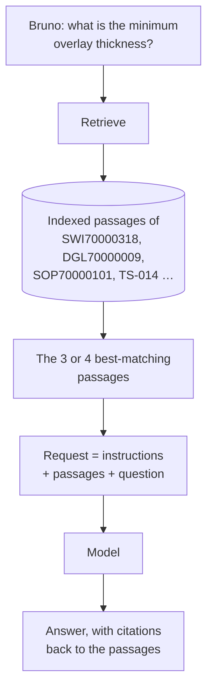

## TL;DR

Retrieval-augmented generation is two steps. **Retrieve**: find the passages of your content most
likely to answer this question. **Generate**: put them in the request and ask the model to answer
from them. That is all it is. It is how an agent answers from company data without the model ever
having been trained on it, and it is the mechanism behind every knowledge source in Copilot Studio.

## Why it matters

[B1](../B1/hallucination.html) established the problem: a model asked about Technik data it has never
seen will produce a plausible answer rather than no answer. RAG is the fix that changes the
mechanism rather than discouraging the symptom — with the real clause sitting in the context,
reproducing it becomes far more likely than inventing one.

It is also the cheapest fix available. No training, no model change, and when a document is revised
the agent is current the moment the new version is indexed. Compare that with fine-tuning, which
[B1 covered](../B1/training.html): a retrain, and still no citations.

## How it works

**Chunking.** Documents are split into passages before they are indexed, because retrieving a
whole nine-page instruction would fill the context with mostly irrelevant text. Where the splits
fall matters: a chunk that cuts a table in half retrieves badly, and a criterion separated from its
heading loses the context that made it findable. You do not control chunking in Copilot Studio;
A8 in the Advanced track does control it, and shows what changes.

**Indexing.** Each chunk is stored so it can be found later — by keyword, by meaning, or both.
Meaning-based retrieval is what lets "how thick does the cladding need to be" find a passage that
says "finished overlay thickness shall be not less than 3.0 mm" with barely a word in common.

**Retrieval.** The question is matched against the index and the best few chunks come back. *Few* is
the point: three good passages beat thirty mediocre ones, both in cost and in answer quality.

**Generation.** The chunks go into the request along with the instructions and the question, and the
model writes an answer from them. Citations are the record of which chunk each part came from.

### What RAG does not fix

Being precise about this saves a lot of wasted effort.

- **It does not guarantee the answer is right.** The model can still misread a passage it was given
  correctly. [B1's exercise](../B1/exercise.html) is an audit of exactly that case.
- **It does not fix a question the content does not answer.** If no Technik document states a
  tolerance, retrieval returns the nearest thing, and the nearest thing is where blending starts.
- **It does not choose between sources that disagree.** Retrieval hands the model whatever matched.
  Which one governs is an instruction you write.
- **It does not make the content good.** A badly written procedure retrieves badly and answers
  badly.

## In practice at Technik

Bruno asks: *"What is the minimum overlay thickness, and why is it that?"*

Retrieval will find passages from three documents, because all three are relevant:

| Source | Passage | What it contributes |
|---|---|---|
| `SWI70000318` §5.1 | "not less than 3.0 mm at every measurement point", eight measurement points | The requirement |
| `DGL70000009` §3 | 0.5 mm dilution + 1.0 mm machining + 1.5 mm service | The reason |
| `TS-014` (intranet) | The summary table, and "where this differs from the work instruction, the work instruction wins" | The precedence rule |

A good answer uses all three: the number from the work instruction, the reasoning from the design
guidelines, and a citation to each. This is retrieval working as intended — not finding *the*
document, but assembling an answer from several.

Now consider what happens in six months, when `ECN70000042` is released and `SWI70000318` reaches
revision C with different criteria. The intranet summary is not automatically updated. Retrieval
will happily return the stale summary alongside the current instruction, because it is still a good
keyword and semantic match. Nothing errors.

> [!IMPORTANT]
> That is the shape of the most dangerous knowledge failure: not a missing document, but a
> retrievable one that is out of date. The mitigation is not technical. It is an instruction telling
> the agent which source governs, and a habit of retiring summaries when the thing they summarise
> changes. `TS-014` states its own precedence rule for precisely this reason.

## Design guidance

- **Fewer, better sources.** Every source you add gives retrieval more chances to return something
  irrelevant. Curate before you index.
- **Prefer the governing document to a summary of it.** Where you keep both, say in the instructions
  which wins.
- **Write content that retrieves well**: real headings, one idea per section, tables that are not
  split across pages, and the words users actually use.
- **Instruct the agent to answer only from its sources**, and to say when they do not cover the
  question. Abstention has to be asked for.
- **Require citations** wherever someone might act on the answer.
- **Test with questions the content does not answer**, not only with ones it does.

## Pitfalls

| Symptom | Cause | Fix |
|---|---|---|
| Confident answers with no citations | Nothing instructed the agent to cite, or nothing was retrieved and it answered anyway | Instruct it to cite and to abstain; check the test pane for what was retrieved |
| Answers got worse after adding a source | Irrelevant passages now compete for the context | Remove or narrow the source; route between sources (A8) |
| The right document is found, the wrong clause quoted | Retrieval returned a neighbouring chunk | Check what was retrieved; improve headings; see A8 for chunking |
| A stale summary is quoted as current | It still matches the question perfectly | State source precedence in the instructions; retire summaries when the source changes |
| Nothing is ever retrieved | Permissions, indexing not finished, unsupported format, or a genuine mismatch | See [Citations & Answer Quality](citations.html) — there are five usual causes |
| Costs rose sharply | Passages are now carried on every request | Reduce how many are retrieved; only search knowledge when the question needs it |

## Key terms

**Retrieval-augmented generation (RAG)** — finding relevant content and adding it to the request so
the model answers from it.

**Chunk** — one passage of a document as it is indexed and retrieved.

**Index** — the searchable store of chunks.

**Semantic search** — retrieval by meaning rather than by shared words.

**Grounding** — the general idea RAG implements: answering from supplied content rather than from
the model's parameters.

**Citation** — the link from a statement in the answer back to the chunk it came from.

**Abstention** — declining to answer when the sources do not cover the question. A feature you must
ask for.
