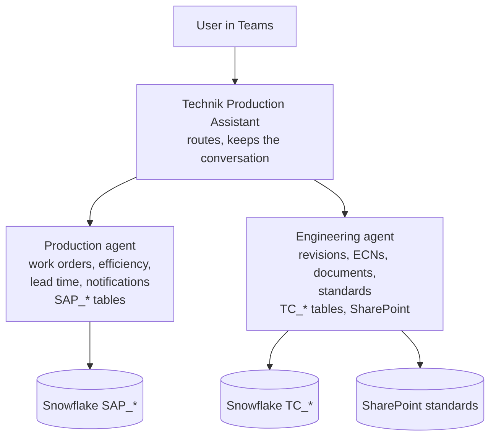

## TL;DR

One agent with twenty tools is worse than two agents with ten each, because the orchestrator chooses
by reading descriptions and the reading gets harder as the list grows. **Child agents** live inside
a parent and handle a specialised part of its job. **Connected agents** are separate agents, with
their own lifecycle and owners, that another agent can hand work to. Both are the same idea as
splitting a large class into smaller ones, and the trigger for both is the same: the thing has more
than one job.

## Why it matters

Agents grow. The Technik Production Assistant starts with one tool and ends the Beginner track with
seven capabilities, a skill, a flow and a knowledge base. Somewhere along that path two things start
happening: the orchestrator picks the wrong tool more often, and every change risks breaking an
unrelated capability.

Splitting fixes both, and it has an organisational benefit that matters more in the long run: a
separate agent can have a separate owner. The team who own Teamcenter data can maintain the
engineering agent without touching the production agent.

## How it works

**Child agents** sit inside a parent agent. The parent routes a request to the child, the child does
its work with its own instructions and its own tools, and control returns. To the user it is one
agent. To you it is a module boundary.

**Connected agents** are standalone agents — their own solution, their own publishing, their own
owners — that another agent can call. To the user it can still look like one assistant, but the
agents are independently deployable.

<!-- volatile verified=2026-09 -->
Copilot Studio supports both patterns, and which is available depends on the harness. The authoring
steps and the terminology have both changed more than once — check the linked documentation for the
current model before designing around a specific behaviour.
<!-- /volatile -->

### When to split

Split when **two or more** of these are true:

- the agent has capabilities that share no tools and no vocabulary;
- the tool catalogue is large enough that routing mistakes are recurring;
- different teams own different capabilities, or want different release cadences;
- the instructions have grown long enough that parts of them are irrelevant to most requests;
- different parts need different identities, different knowledge permissions, or different models.

Do **not** split because it looks tidier. Every boundary costs something: an extra hop of latency,
context that has to be handed across, and a new class of bug where the handoff loses a detail the
user gave three turns ago.

### What crosses the boundary

This is the part that bites. When a parent hands work to a child, what does the child know?

- The request, as the parent chose to phrase it — which may not be what the user said.
- Whatever context the platform passes, which is less than the whole conversation.
- Nothing the user established earlier unless it was carried deliberately.

Ana's "only Plant 1" from two turns ago is exactly the kind of thing that gets lost. Design the
handoff to carry the constraints, and test multi-turn conversations across it rather than single
questions.

## In practice at Technik

The Beginner track keeps one agent. It is the right call: seven capabilities over one company's data,
one owner, one release. Splitting early would be architecture for its own sake.

A6 in the Advanced track splits it, and the reason is worth understanding because it is not
primarily about tool count:

| | Production agent | Engineering agent |
|---|---|---|
| Data | `SAP_*` — work orders, operations, notifications | `TC_*` — parts, drawings, documents, ECNs — and SharePoint standards |
| Questions | Status, efficiency, lead time, quality | Which revision, why it changed, what the procedure says |
| Users | Planners, supervisors, quality engineers | Manufacturing and design engineers |
| Identity | Snowflake read-only role | Snowflake read-only role **plus** per-user SharePoint permissions |
| Changes when | SAP replication changes | Teamcenter or the document set changes |

The identity row is the strongest argument. The engineering side needs per-user document permissions;
the production side does not. Two agents let each have the identity model that fits, instead of one
agent carrying the union of both.

The handoff row is where the work is. "What is the status of work order `100004521`, and is it on the
right drawing revision?" needs both agents, and the answer is only useful if the second one is told
which drawing and which revision the first one found.

> [!TIP]
> Before splitting, try the cheap fixes: sharpen descriptions, add exclusions, merge overlapping
> tools, shorten the instructions. They fix more routing problems than people expect, and they cost
> an afternoon rather than a redesign.

## Design guidance

- **Split along data and ownership**, not along tool count.
- **Give each agent one job you can state in a sentence.** If you cannot, the boundary is wrong.
- **Design the handoff explicitly.** Decide what must cross, and pass it.
- **Test conversations, not questions.** Multi-turn tests across a boundary find what single
  questions never will.
- **Keep one front door.** Users should not have to know which agent to ask.
- **Watch latency.** Every hop is another turn.
- **Let each agent hold only its own tools.** The whole point is a smaller catalogue per decision.

## Pitfalls

| Symptom | Cause | Fix |
|---|---|---|
| Routing got worse after splitting | The parent's description of each child is as vague as a bad tool description | Describe children as carefully as tools: what they cover, what they do not |
| A constraint from earlier in the chat is ignored after a handoff | Context did not cross the boundary | Carry constraints explicitly; test multi-turn |
| Noticeably slower answers | Extra hops | Split less, or handle common questions before routing |
| Two agents can answer the same question, differently | Overlapping scope | Redraw the boundary; one owner per capability |
| Users ask the wrong agent | More than one front door | Publish one, keep the rest internal |
| A change to one agent broke another | Shared tools or shared assumptions | Make the interface explicit; version it |

## Key terms

**Child agent** — a specialised agent inside a parent. One agent from the user's point of view.

**Connected agent** — a standalone agent another agent can hand work to, with its own lifecycle.

**Handoff** — passing a request, and the context it needs, from one agent to another.

**Orchestration** — deciding what to do next: which tool, which knowledge, which agent (B4).

**Front door** — the agent users actually talk to.
