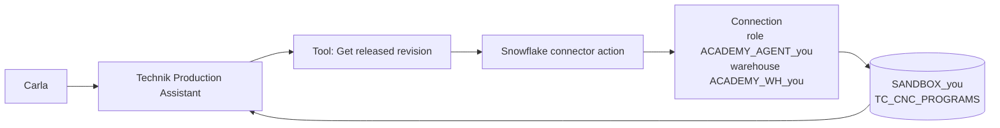

## TL;DR

A connector is a prebuilt wrapper around an API. Microsoft ships more than a thousand — Outlook,
SharePoint, Dataverse, ServiceNow, SAP, Snowflake — and each exposes **actions** (do something) and
sometimes **triggers** (start a flow when something happens). The same connector works in Power
Automate, Power Apps and Copilot Studio, so one connection and one set of credentials serve all
three. When no connector exists, you build a **custom connector** and it behaves like the rest.

## Why it matters

Connectors are the reason low-code integration is quick. Without one, reaching Snowflake from an
agent means an API client, authentication, token refresh, error handling and a deployment story.
With one, it means choosing an action and filling in a query.

They are also the boundary your organisation governs. Data policies (DLP) are written in terms of
connectors: which may be used together, which are blocked, which are allowed in which environment.
When a tool mysteriously will not run in production, the cause is usually a policy, not a bug —
B11 covers that.

## How it works

A connector has three parts.

**Actions** — operations you can call. The Snowflake connector's actions submit a statement, check
its status and fetch results. The Outlook connector's actions send mail, create events, and so on.

**Triggers** — events that start a flow: a new email, a new file, a row added. Triggers belong to
flows, not to agents; an agent calls actions.

**Connections** — the stored credentials an action runs under. A connection is created once and
reused. Which identity it holds is the single most consequential decision you will make in this
module, and it has its own lesson: [Connections & Authentication](connauth.html).

Connectors come in tiers that affect licensing — standard connectors are broadly available, premium
ones need the appropriate licence, and Snowflake is premium. Check before you design around one.

<!-- volatile verified=2026-09 -->
In Copilot Studio, a connector action is added from the agent's **Tools** area; you pick the
connector, pick the action, choose or create a connection, and then describe the tool and its
inputs. The exact wording and ordering of those steps changes between releases — follow the linked
documentation rather than a screenshot.
<!-- /volatile -->

### Reading a connector's reference

Every connector has a reference page listing each action, its inputs, its outputs and its limits.
Three things there are worth reading before you build:

- **Throttling limits.** Calls per minute, per connection. An agent used by forty people shares one
  connection's budget.
- **Whether an action is synchronous.** Some return a result; others start something and hand you an
  identifier to poll. Snowflake's statement execution is in the second family, which shapes how you
  use it.
- **Output shape.** Knowing whether you get rows, a JSON blob or a paged result decides how much
  work is left for you.

### The Snowflake connector

<!-- volatile verified=2026-09 -->
The Snowflake connector submits SQL statements to a warehouse and returns the results, and it lets
the connection specify the role, warehouse, database and schema to use. Submitting a statement and
retrieving its result can be separate actions, so a tool may need more than one call, or a flow to
wrap them. Check the connector reference for the current action list and their exact parameters
before you design the tool.
<!-- /volatile -->

Two design points about it are stable, whatever the action list looks like:

**The role in the connection is the security boundary.** Everything the agent can ever do in
Snowflake is what that role can do. This is why the course provisions `ACADEMY_AGENT_<you>` as
read-only and uses it for every connection.

**Whatever SQL you put in the tool is what runs.** A tool that accepts a whole query as a model-filled
input is a tool that will run whatever the model can be persuaded to write. Parameterise the
*values*; fix the *statement*.

## In practice at Technik

Carla asks which CNC program revision to use for `P7000001042`. The chain:

Note where the interesting decisions sit. The agent does not "have access to Snowflake" — it has
access to one connection, which holds one role, which can read one schema and write nothing. Every
question about what the agent could possibly do is answered at that link in the chain, not in the
prompt.

And note what the connector does *not* do: it does not decide which revision is released. That is
the query's job, and the query is where you enforce `RELEASE_STATUS = 'Released'`. A connector is
plumbing. Correctness is still yours.

> [!TIP]
> Before building any connector tool, run the exact SQL in a Snowflake worksheet **as the agent
> role**, not as yourself. Half of all "the tool returns nothing" reports are a permission the
> agent role does not have, and thirty seconds in a worksheet is the cheapest way to find out.

## Design guidance

- **Check the tier and the licence** before designing around a connector. Premium is not a surprise
  you want at deployment.
- **Check throttling** against realistic usage, not against your own testing.
- **One connection per purpose**, with a clearly named identity, rather than one personal connection
  reused everywhere.
- **Never accept a full query as a model-supplied input.** Fix the statement, parameterise values.
- **Test as the agent's identity**, not yours.
- **Expect the DLP conversation early.** Find out which connectors your environment permits before
  you build, not after.
- **Prefer a view to a table** as the connector's target: fewer columns, better names, filtering
  guaranteed.

## Pitfalls

| Symptom | Cause | Fix |
|---|---|---|
| The action is not available in your environment | Premium licensing, or a data policy blocks the connector | Check licensing and DLP policy with your admin |
| Works for you, empty for everyone else | The connection is yours, or runs as each user without their permissions | See [Connections & Authentication](connauth.html) |
| Intermittent failures under load | Connector throttling per connection | Check the connector's documented limits; cache or aggregate rather than calling per row |
| The tool returns nothing, with no error | The role cannot see the object, or the filter excludes every row | Run the SQL as the agent role in a worksheet |
| A query that worked yesterday returns nothing today | The learner sandbox was reset, or the object was recreated | Re-run the reset for the module you are on; check the grants |
| The agent returns a superseded revision | The query does not filter on release status | Fix the SQL. Do not fix it in the prompt |
| Results are huge and slow | No row limit, all columns selected | Limit and project in SQL; aggregate in the source |

## Key terms

**Connector** — a prebuilt wrapper around an API, shared across Power Platform.

**Action** — one operation a connector exposes.

**Trigger** — an event that starts a flow. Flows only, not agents.

**Connection** — stored credentials an action runs under.

**Custom connector** — one you define yourself for a system with no prebuilt connector.

**Premium connector** — a connector requiring the appropriate licence. Snowflake is one.

**Throttling** — the rate limit a connector enforces per connection.

**DLP policy** — the rules deciding which connectors may be used, and together (B11).
