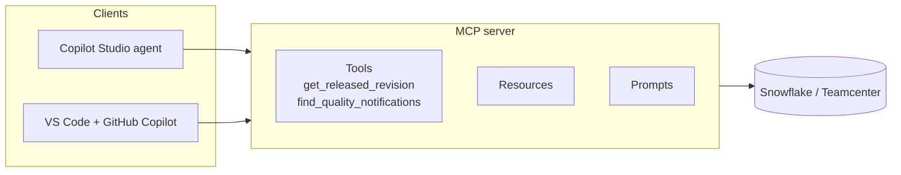

## TL;DR

The **Model Context Protocol (MCP)** is an open standard for connecting AI applications to tools and
data. An **MCP server** exposes a set of tools — each with a name, a description and typed inputs —
and any MCP-capable **client** can use them. Copilot Studio is a client. So is VS Code with GitHub
Copilot, and so are several other products. The value is not that MCP does something a connector
cannot; it is that one server, written once, works everywhere, and that adding a tool to the server
adds it to every agent already connected.

## Why it matters

Without a shared protocol, every integration is bespoke: a connector for Power Platform, a plugin
for one product, an extension for another, each with its own authoring model and its own
maintenance. MCP collapses that. The comparison people reach for is USB-C — one connector shape
instead of a drawer full of adapters — and it is a fair one, as long as you remember that USB-C also
carries power and data at wildly different capabilities depending on what is on each end.

For you, two consequences matter. **You will consume MCP servers** — Snowflake, GitHub and many
others publish them, and adding one is often faster than building the equivalent connector tools.
And **you will eventually publish one**: A5 in the Advanced track builds an MCP server over
Technik's Teamcenter data and connects it to both VS Code and Copilot Studio.

## How it works

An MCP server offers three kinds of thing:

- **Tools** — operations the model can call. This is the part you will use most.
- **Resources** — data the client can read, addressed by URI.
- **Prompts** — reusable prompt templates the server suggests.

A client connects, asks the server what it offers, and adds the result to the catalogue the
orchestrator chooses from. From the orchestrator's point of view an MCP tool and a connector action
are indistinguishable: both are a name, a description, some inputs and a result.

Servers run either **locally**, launched by the client on the same machine and talking over standard
input and output, or **remotely**, reached over HTTP. Local servers suit developer tooling — a
server on your laptop that reads your repository. A cloud service like Copilot Studio needs a remote
one, which means the server needs an address, a transport and an authentication story.

### MCP versus a connector

| | Connector action | MCP server |
|---|---|---|
| Scope | One operation | A set of related tools |
| Authoring | Configured in the maker portal | Code, deployed and versioned like a service |
| Reuse across products | Power Platform | Any MCP client |
| Adding a capability | Add another tool to the agent | Add a tool to the server; connected agents pick it up |
| Governance | DLP policies, connection references | Whatever your organisation applies to services, plus the client's own controls |
| Right for | A single well-defined call | A coherent capability area with several operations |

The row that decides most real cases is the fourth. If Technik's revision capability will grow —
released revision today, ECN history next month, affected-items lookup after that — a server keeps
the growth in one place. If you need exactly one query, a connector action is less machinery.

### What to check before enabling one

An MCP server is code someone else wrote, whose tools your agent will call with your agent's
identity. Before enabling it:

- **Who publishes it**, and is it certified or internally approved?
- **What can each tool actually do?** Read the tool list. A server whose name suggests reading may
  expose a write.
- **What identity does it act with**, and against which system?
- **Where does the data go?** A remote server sees everything you send it.
- **How does it change?** Tools flowing in automatically is the feature, and it also means the
  catalogue can change without you editing anything. Pin versions where you can.

> [!WARNING]
> "Tools update automatically" is the selling point and the risk in one sentence. A server you
> approved for two read-only tools can ship a third that writes. Prefer certified or internally
> reviewed servers, and re-check the tool list when a server updates.

## In practice at Technik

Two MCP servers show up in this course.

**One you consume, in this module's lab.** You add an existing MCP server to the Technik Production
Assistant and watch its tools appear in the agent alongside the connector tool you built by hand.
The point of the exercise is the comparison: the same orchestrator, the same routing behaviour, and
a very different authoring path.

**One you build, in A5.** A Technik MCP server exposing revision lookups and notification search
over Snowflake. Connected to VS Code, it lets an engineer ask about a part number while writing SQL.
Connected to Copilot Studio, it serves the same capability to the assistant in Teams. One
implementation, two surfaces — which is the whole argument for MCP in a sentence.

Note what MCP does *not* change. The server still queries Snowflake through a role, and that role
should still be `ACADEMY_AGENT_<you>`, read-only. The protocol makes tools portable. It does not make
them safe, and every question in [Connections & Authentication](connauth.html) applies unchanged.

## Design guidance

- **Consume before you publish.** Add someone's server, see how tool discovery behaves, then decide
  whether yours is worth building.
- **Group by capability.** A server should be a coherent area — "Teamcenter revisions" — not a bag of
  unrelated functions.
- **Write tool descriptions as carefully as connector ones.** Identical rules; the orchestrator
  cannot tell the difference.
- **Scope the server's identity.** It is a service with credentials. Give it the least it needs.
- **Prefer approved servers.** Treat an unreviewed third-party server the way you would treat an
  unreviewed dependency, because that is what it is.
- **Watch the tool count.** A server contributing twelve tools makes the orchestrator's job harder,
  the same as twelve tools added by hand.

## Pitfalls

| Symptom | Cause | Fix |
|---|---|---|
| The server will not connect from Copilot Studio | It is a local server; a cloud client needs a remote one | Deploy it with an address and a supported transport |
| Tools appeared that you did not approve | The server updated its tool list | Review on update; pin a version; prefer approved servers |
| The agent calls an MCP tool instead of yours | Overlapping descriptions | Sharpen both; remove the duplicate capability |
| Works in VS Code, not in the agent | Different transport, or authentication the cloud client cannot provide | Check what the client supports |
| Sensitive data reaching a third party | A remote server sees everything sent to it | Know where it runs; keep sensitive capability in-house |
| The agent's routing got worse after adding a server | The catalogue grew by several tools at once | Enable only the tools you need; consider a connected agent (A6) |

## Key terms

**MCP (Model Context Protocol)** — an open standard for connecting AI applications to tools and data.

**MCP server** — a process exposing tools, resources and prompts over the protocol.

**MCP client** — an application that connects to servers. Copilot Studio and VS Code are both.

**Tool discovery** — the client asking a server what it offers, so new tools appear without
re-authoring.

**Transport** — how client and server talk: standard input and output for a local server, HTTP for a
remote one.

**Resource** — data a server exposes for reading, addressed by URI.
