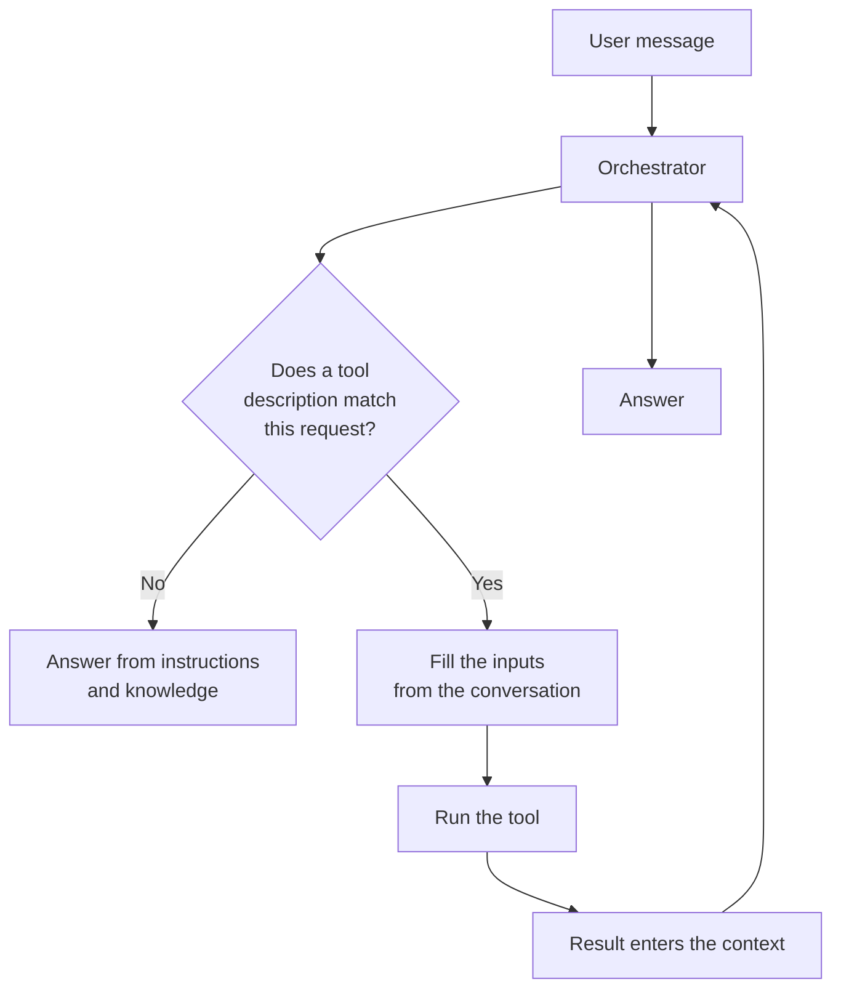

## TL;DR

A tool is anything an agent can *call* rather than *say*. Connector actions, agent flows, prompts,
REST APIs, MCP servers and computer use are all tools, and to the orchestrator they look the same:
a name, a description, some typed inputs, and a result that comes back as text in the context. The
orchestrator decides which to call by **reading the name and the description**. That single fact
determines most of what makes tools work or fail, and it means the highest-value work in this module
is writing clearly.

## Why it matters

Everything specific to your company — a work order status, a released revision, an open notification
— lives in a system the model cannot reach. Knowledge sources (B6) get you documents. Tools get you
everything else, and they let the agent *act*: create a record, start an approval, send a message.

Tools are also where an agent stops being a demo. An assistant that summarises documents is useful.
An assistant that answers "where is work order `100004521` and what is holding it up" is the thing
people actually asked for.

## How it works

When a request arrives, the orchestrator sees the user's message plus a catalogue of what it could
do: each tool's name, its description, and a description of each input. It decides whether to call
one, invents values for the inputs from the conversation, runs it, reads the result, and either
answers or calls something else.

Two things in that loop deserve attention.

**Inputs are invented by the model.** Nothing validates that "the valve block" became
`P7000001042`. If the user was vague, the model guesses, and the guess may be plausible and wrong.
Inputs you can fix — a role, a schema name, a row limit — should be fixed by configuration, not left
for the model to fill (see [Adding a Connector Tool](addconnector.html)).

**The result becomes context.** Whatever a tool returns is read by the model as text, costing tokens
and competing with everything else in the window. A tool that returns 300 rows does not just cost
money; it makes the answer worse.

### The kinds of tool

| Kind | What it is | Reach for it when |
|---|---|---|
| **Connector action** | One operation on a prebuilt API wrapper — Snowflake, SharePoint, Outlook, Dataverse | You need a single, well-defined call |
| **Agent flow** | A deterministic automation with conditions, error handling and approvals, called as one tool | The business process must run the same way every time (B9) |
| **Prompt** | A reusable, parameterised instruction to a model, returning text or JSON | The work *is* language: classify, extract, rewrite (B9) |
| **REST API / custom connector** | Your own service | No connector exists for the system |
| **MCP server** | A server exposing a set of tools over an open protocol | You want a maintained set of related tools, and updates to flow in without re-authoring ([MCP](mcp.html)) |
| **Computer use** | Driving a website or desktop app like a person | There is genuinely no API ([Computer Use](computeruse.html)) |

<!-- volatile verified=2026-09 -->
In Copilot Studio these are added from the agent's **Tools** area, and the kinds on offer differ by
harness. Check the linked documentation for the current list and the exact path — this part of the
product changes often, and a click-path learned today will be wrong within a release or two.
<!-- /volatile -->

### Names and descriptions are the routing logic

This is the part people skip. Compare:

> **Name:** `Run query`
> **Description:** Runs a query against the database.

with:

> **Name:** `Get released revision`
> **Description:** Returns the current released revision of a part, drawing, controlled document or
> CNC program from Teamcenter, with the date it was released and the ECN that introduced it. Use
> when the user asks which revision to use, whether something is up to date, or about revision
> history. Do not use for work order status.

The second tells the orchestrator four things: what it returns, which vocabulary signals it, what
counts as a match, and what does not. The first tells it nothing, so it will be called for anything
vaguely database-shaped and missed for everything else.

Write descriptions as if for a competent new colleague who will never ask you a follow-up question,
because that is exactly the situation.

## In practice at Technik

The Technik Production Assistant needs seven capabilities. Mapping them to tool kinds is a useful
exercise in itself:

| Capability | Tool | Why |
|---|---|---|
| Work order status and current operation | Snowflake connector action | One query, one shape of answer |
| Efficiency by operation, work centre, period | Snowflake connector action over a view | The view does the deduplication and the arithmetic (B10) |
| Lead time | Snowflake connector action over a view | As above |
| Find and summarise quality notifications | Connector action, then the model summarises | Retrieval is a tool; summarising is the model's own job |
| Engineering questions from documents | *Not a tool* — knowledge | Retrieval over documents is B6's job, not a tool call |
| Teamcenter revision information | Snowflake connector action — **this module's lab** | |
| Draft a document revision and route it | Agent flow | Multi-step, needs an approval, must be identical every time (B9) |

Two things are worth noticing. The document-based capability is not a tool at all — reaching for one
where knowledge already works is a common and expensive mistake. And the two metric capabilities go
through a *view*, not the raw tables, because the deduplication that makes efficiency correct
belongs in SQL where it is enforced, not in a prompt where it is a suggestion.

> [!IMPORTANT]
> A tool result is data the agent reads, and some of that data is written by people. A quality
> notification description is free text from the shop floor. Treat everything a tool returns as
> content to be reported, never as instructions to be followed — the Technik data contains
> notifications that try exactly that, and B11 makes you look at them.

## Design guidance

- **One tool, one job.** Two narrow tools with sharp descriptions beat one general tool with a vague
  one, every time.
- **Write the description before you build the tool.** If you cannot describe when it should be used
  in two sentences, the boundary is wrong.
- **Say what a tool is *not* for.** An explicit exclusion resolves most misrouting.
- **Fix what should be fixed.** Role, warehouse, schema, row limit: configuration, not model input.
- **Bound every result.** Row limits and selected columns, always.
- **Prefer a view to a table.** Business-friendly names are better descriptions for free, and the
  filtering is guaranteed.
- **Test the routing, not just the tool.** The tool working and the orchestrator choosing it are two
  different things, and the second fails more often.

## Pitfalls

| Symptom | Cause | Fix |
|---|---|---|
| The tool is never called | The description does not match how users ask | Rewrite it using the user's vocabulary; add trigger-like phrasing |
| The wrong tool is called | Two descriptions overlap | Sharpen the boundary; state what each is not for |
| The tool is called with the wrong values | The model inferred inputs from a vague request | Describe each input precisely; have the agent confirm before acting |
| It works for you, fails for a colleague | The connection authenticates as you | See [Connections & Authentication](connauth.html) |
| Answers got slow and expensive after adding a tool | Unbounded results filling the context | Limit rows, select columns, aggregate in the source |
| The agent narrates what it would do instead of doing it | No tool matched, so it fell back to language | Check the description; check the tool is enabled for this agent |
| Adding the tenth tool broke the previous nine | The orchestrator's choice degrades as the catalogue grows | Merge, remove, or split the agent ([Connected & Child Agents](connected.html)) |

## Key terms

**Tool** — anything an agent can call. Named, described, typed inputs, a result.

**Orchestrator** — the component that decides which tool to call and with what.

**Tool description** — the text the orchestrator matches against. The routing logic, not documentation.

**Input schema** — the typed parameters a tool accepts, each with its own description.

**Agent flow** — a deterministic automation exposed to the agent as a single tool (B9).

**Connector action** — one operation of a prebuilt API wrapper ([Power Platform Connectors](connectors.html)).

**MCP server** — a server exposing a set of tools over the Model Context Protocol ([What Is MCP](mcp.html)).
