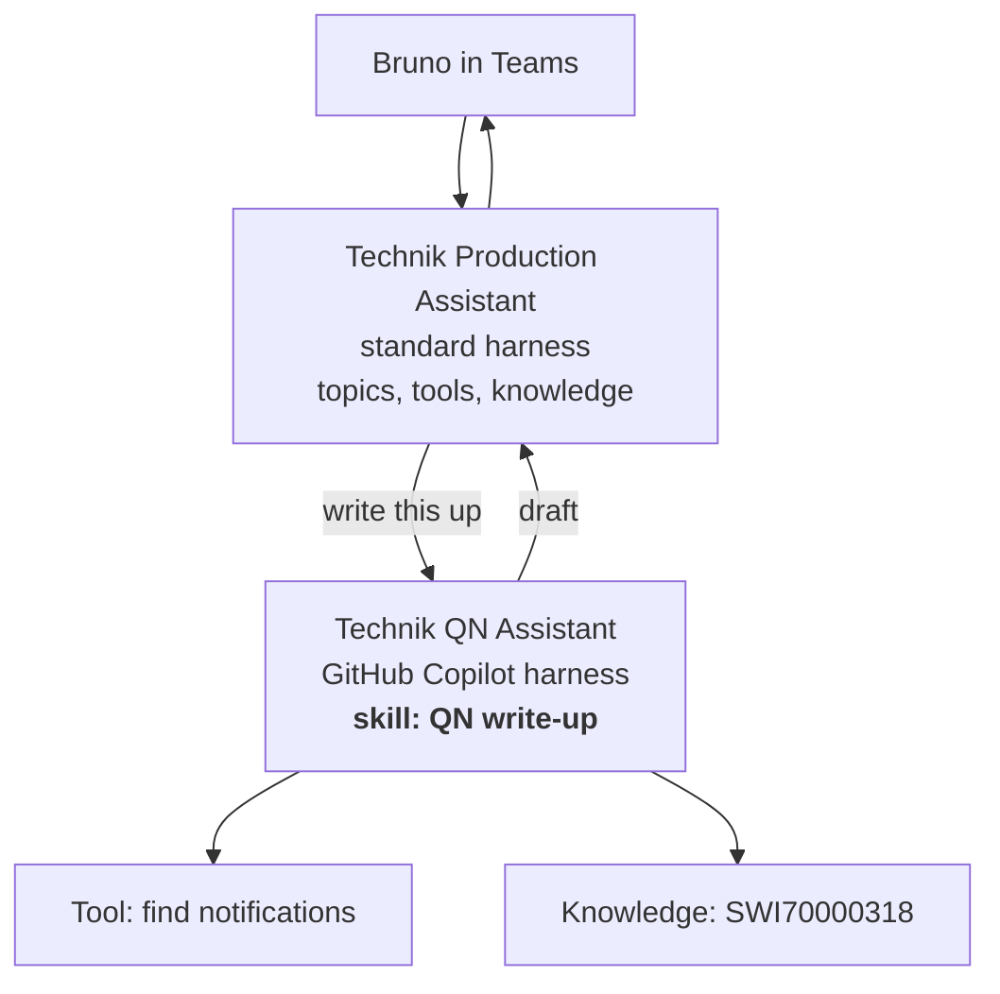

## TL;DR

Standard-harness agents do not support skills. If your agent was created on the standard harness —
as the Technik Production Assistant was, in B5 — you cannot add one, and you cannot switch harness
afterwards. Reuse comes instead from **shared tools**, **agent flows**, **child and connected
agents**, and **component collections**. The best answer is usually to put the skill on an agent
that can hold one and connect it, so the know-how still lives in exactly one place.

## Why it matters

This is where B4's harness decision stops being theoretical. You chose at creation, possibly months
ago, possibly without knowing it mattered, and it is not reversible. Rebuilding an agent on a
different harness means rebuilding its topics, re-binding its connections, re-testing everything and
re-publishing — a real project, not a setting.

Knowing the options that remain, and which of them keeps one copy of the know-how, is the whole
lesson.

## How it works

Four ways to reuse behaviour without skills:

| Pattern | What it shares | Costs |
|---|---|---|
| **Shared tool** | An action, used by any agent | Only actions. No procedure, no judgement |
| **Agent flow** | A whole deterministic process, called as one tool | No judgement. Lives in a designer, not in Markdown |
| **Child or connected agent** | Everything, including skills — on *its* harness | A hop of latency, and a handoff that must carry context |
| **Component collection** | Topics and components, copied between agents | It is a *copy*. Copies drift |

The column that decides it is the last one. A component collection duplicates; a connected agent
delegates. Duplication is quicker today and is how the same procedure ends up behaving two ways.

### The pattern that actually works

The main agent keeps its topics and stays where users already find it. The specialist agent holds
the skill, on a harness that supports skills. One copy of the procedure, one owner, and the user
never knows there are two agents.

<!-- volatile verified=2026-09 -->
Whether a standard-harness agent can connect to an agent on a different harness, and how that is
configured, is exactly the kind of thing that changes between releases. Check the linked
documentation before committing to this design — and if it is not available in your tenant, the
fallback is an agent flow that calls an AI Builder prompt carrying the same instructions, which
duplicates the know-how but keeps it in one file.
<!-- /volatile -->

### What you give up

Be honest about the delegation cost, because it is real:

- **Latency.** Another agent is another turn.
- **Context across the handoff.** What Bruno said three turns ago does not automatically travel.
  [B7's connected agents lesson](../B7/connected.html) is about exactly this failure.
- **Two things to publish, two things to permission.** The specialist agent needs its own
  connections and its own sharing.
- **A second place to look** when something goes wrong.

## In practice at Technik

The assistant is on the standard harness and stays there. B5 built it that way for a reason — the
*Work order status* topic is a scripted exchange, and topics are standard-harness only — and by B12
it is published to Teams with users who know where to find it.

So the lab does this:

1. Builds a second agent, *Technik QN Assistant*, on the GitHub Copilot harness.
2. Puts the `QN write-up` skill on it, with the tool and knowledge it needs.
3. Connects it to the Technik Production Assistant.

Bruno asks the assistant he already uses. The assistant recognises a write-up request and hands it
over. The skill file is the only copy of Technik's write-up procedure, and the quality engineer who
owns `SOP70000101` can own it.

The alternative — rebuilding the write-up as a topic plus an AI Builder prompt inside the standard
harness — is not wrong, and is the right answer if the extra hop matters more than the duplication.
It costs you a second copy of the procedure that will be revised once and forgotten once.

> [!TIP]
> When you create an agent, write down why you chose the harness. Not for the audit — for the person
> in six months who asks why this one cannot have skills. "Because it needs topics" is a good answer
> and takes ten seconds to record; reconstructing it later takes an afternoon.

## Design guidance

- **Delegate rather than duplicate.** A connected agent keeps one copy of the know-how; a component
  collection does not.
- **Choose the harness deliberately at creation**, and record why.
- **Do not rebuild an agent to gain skills** unless the capability is genuinely central. It is a
  project.
- **Keep the front door stable.** Users should keep talking to the agent they know.
- **Design the handoff explicitly** and test multi-turn conversations across it.
- **If you must duplicate, keep one source file** and generate both copies from it.

## Pitfalls

| Symptom | Cause | Fix |
|---|---|---|
| There is no Skills area on the agent | It is on the standard harness | Use one of the four patterns; skills are not coming to it |
| "We will just switch harness" | The harness is chosen at creation and cannot be changed | Plan a rebuild, or delegate instead |
| Two agents word the same procedure differently | The behaviour was copied, not shared | One skill, one owner, delegate to it |
| The specialist agent loses a constraint from earlier in the chat | Context did not cross the handoff | Carry it explicitly; test multi-turn (B7) |
| Noticeably slower once delegation was added | An extra hop per request | Handle common cases before routing, or accept it |
| The specialist works for you and not for users | It has its own connections and sharing | Publish and permission both agents (B12) |

## Key terms

**Harness** — the runtime an agent was created on. Decides whether skills are available, and cannot
be changed afterwards (B4).

**Connected agent** — a standalone agent another agent hands work to.

**Child agent** — a specialised agent inside a parent; one agent from the user's point of view.

**Component collection** — a package of topics and components copied between agents. A copy, not a
link.

**Handoff** — passing a request, and the context it needs, from one agent to another.

**Front door** — the agent users actually talk to.
