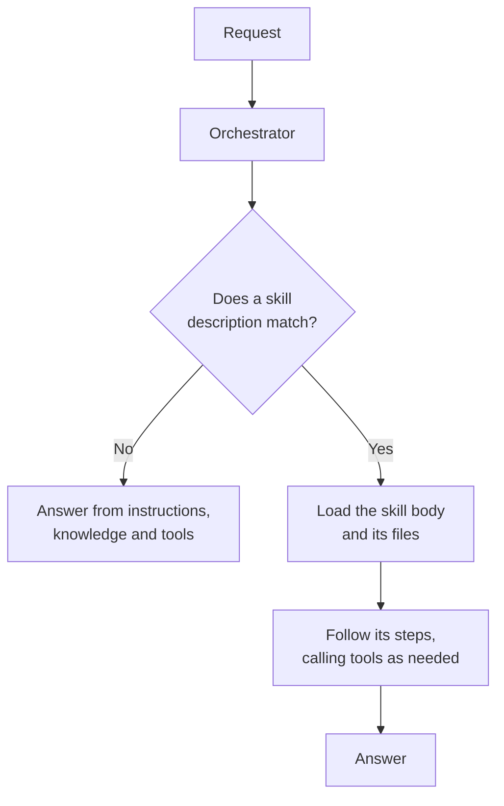

## TL;DR

A skill is a reusable capability written as Markdown. It has a **name**, a **description** that
decides when it is used, **instructions** telling the agent how to carry out that kind of task, and
optionally **files** it carries with it. The orchestrator reads only the description until a request
matches; then it loads the rest. That is what lets an agent hold a great deal of know-how without
paying for all of it on every turn.

## Why it matters

Agent instructions are read on **every single request**. Put Technik's quality notification format
in them and every question — including "what PPE do I need in coating?" — carries it. Do that four
or five times, for four or five procedures, and you have an agent whose instructions are three
thousand tokens of mostly irrelevant detail, slower and worse at everything (see
[Context](../B1/context.html)).

A skill inverts that. The know-how sits outside the instructions, costs one line of description
until it is needed, and is a file a person can read, review and version. That last part matters more
than it sounds: a procedure written in a skill is a procedure someone can send to a colleague.

## How it works

A skill is, at minimum, a `SKILL.md` file:

```markdown
---
name: QN write-up
description: Drafts a quality notification write-up in Technik's format from a
  described finding. Use when someone reports a defect and wants it written up,
  or asks for help wording a notification.
---

## When to use this
...

## How to write the notification
1. ...
```

**Name** — short, and what the behaviour is called.

**Description** — the only part the orchestrator sees before deciding. It must say what the skill
does *and* when a request counts as a match, in the words people actually use. Everything said about
[tool descriptions](../B7/addconnector.html) applies here unchanged.

**Instructions** — the body. Steps, rules, worked examples, the house format. Written for the agent,
but read by humans in review.

**Files** — a bundle may carry extra files: a template, a checklist, a reference table. They travel
with the skill, which is how the know-how stays together.



Two properties follow from that diagram.

**Skills compose with tools.** A skill does not replace tools; it orchestrates them. The write-up
skill calls the notification tool to fetch the work order's history, then follows its own steps to
write the draft.

**Skills are progressive.** The description is cheap and always present; the body is expensive and
loaded on demand. Designing a skill is largely deciding what belongs in the always-present line and
what can wait.

<!-- volatile verified=2026-09 -->
Skills are a feature of the **GitHub Copilot harness** in Copilot Studio. Where they are authored,
what a bundle may contain, and the size limits on files all change between releases — check the
linked documentation. What does not change is the shape: name, description, instructions, files.
<!-- /volatile -->

## In practice at Technik

Bruno's write-up is a good skill and an obvious one once you see the test: **done often, the same
way, where the *how* is written down and nobody remembers all of it.**

| | Bruno's write-up |
|---|---|
| Done often? | Three or four a week, by several people |
| The same way every time? | Yes — `SOP70000101` §3 fixes the content, `GWI70000027` §5 fixes the order |
| Is the *how* written down? | Yes, across two documents, which is why nobody follows all of it |
| Does it need judgement? | Yes: which criterion applies, what disposition to request. So not a flow |

That last row is what makes it a skill rather than an agent flow. A flow runs the same steps every
time and produces the same shape of output; this task needs the agent to decide which acceptance
criterion the finding breaches and how to word a disposition request. A skill gives it the procedure
and leaves the judgement.

Compare with things at Technik that are **not** skills:

| Task | Why not |
|---|---|
| Look up the released revision of a part | One action, no procedure. A **tool** (B7) |
| Route a document revision for approval | Must happen identically every time, with an approval step. An **agent flow** (B9) |
| Ask for a work order number and confirm it | A scripted exchange. A **topic** (B5) |
| Answer what `SWI70000318` says about porosity | Retrieval. **Knowledge** (B6) |

> [!TIP]
> If you can write the procedure down in Markdown and hand it to a new colleague, it is probably a
> skill. If handing it over would need you to also explain when to bend the rules, it is a skill
> with the bending rules written in. If there are no rules to bend, it is a flow.

## Design guidance

- **One skill, one kind of task.** Two narrow skills beat one that covers "quality stuff".
- **Write the description first.** If you cannot say when it applies in two sentences, the boundary
  is wrong.
- **Keep instructions procedural.** Numbered steps, explicit rules, a worked example. Not prose
  about the domain.
- **Bundle what the procedure needs**, rather than pasting a template into the instructions.
- **Say what the skill must not do** — invent readings, propose a disposition nobody asked for,
  close anything.
- **Review it like a document.** It is Markdown a human can read; use that.
- **Version it.** When the underlying procedure is revised, the skill is out of date, and nothing
  will tell you.

## Pitfalls

| Symptom | Cause | Fix |
|---|---|---|
| The skill never triggers | The description does not match how people ask | Rewrite it from real requests; do not touch the instructions |
| It triggers on unrelated requests | The description is too broad, or overlaps a tool | Narrow it; say what it is not for |
| The agent follows some steps and not others | Instructions read as prose rather than as steps | Number them; make rules imperative |
| Output drifts between runs | Nothing fixed the format | Include the exact structure, and an example |
| The skill is out of date with the procedure | The source document was revised; nothing linked them | Cite the document and revision in the skill; re-check when it changes |
| The agent has no skills section at all | It is on a harness that does not support them | See [Reuse in the Standard Harness](reuse.html) |

## Key terms

**Skill** — a reusable capability: name, description, Markdown instructions, optional files.

**`SKILL.md`** — the file holding a skill's front matter and instructions.

**Skill bundle** — a skill plus the files it carries.

**Progressive loading** — only the description is always present; the body is loaded when it
matches.

**Agent Skills format** — the open format shared with GitHub Copilot, so a skill written once can be
used in more than one place ([Add an Existing Skill](addskill.html)).

**Harness** — the runtime an agent was created on, which decides whether it can hold skills at all
(B4).
