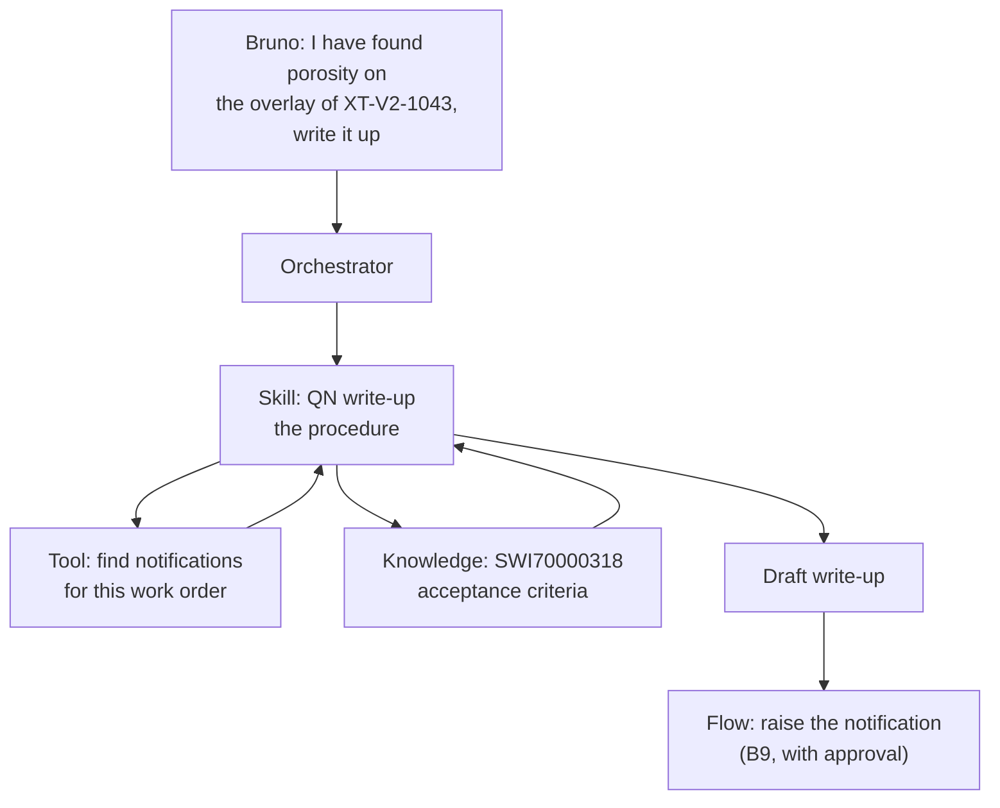

## TL;DR

**Tools** perform an action. **Skills** hold reusable know-how about how to carry out a kind of
task. **Topics** are scripted conversation paths in the standard harness. **Flows** run a business
process the same way every time. A skill often uses several tools; a topic fixes the exact steps and
leaves nothing to judgement. Choosing between them is mostly one question — *how much of this must
be identical every time?* — and getting it wrong is how agents become either rigid or unreliable.

## Why it matters

The four look interchangeable from a requirements document. "Draft a quality notification" could be
a topic, a skill or a flow, and all three can be made to work. They fail differently, though, and
they fail at different times: a flow that needed judgement fails on the first unusual case, and a
skill that needed determinism fails an audit six months later when nobody can say what it did.

## How it works

| | Does what | Determinism | Judgement | Harness |
|---|---|---|---|---|
| **Tool** | One action: a query, an API call, a flow invocation | The action is fixed; *when* it is called is not | The orchestrator decides whether and with what | Both |
| **Skill** | Follows a written procedure, calling tools as needed | The procedure is fixed; the wording and the decisions are not | Yes, within rules you write | GitHub Copilot harness |
| **Topic** | Runs a designed conversation, node by node | Almost total: you drew the path | Only where you put a condition | Standard harness |
| **Flow** | Runs a business process with conditions, error handling, approvals | Total | None | Both, as a tool |

### The question that decides it

**How much of this must be identical every time?**

- **All of it** → flow. Money, approvals, records in systems of record, anything an auditor will ask
  about.
- **The path, but not the words** → topic. A compliance check, a structured intake, a confirmation.
- **The procedure, but not the outcome** → skill. Write-ups, analyses, drafts — where the steps are
  fixed and the content is judgement.
- **Just this one action** → tool.

A second question settles most of the remainder: **who needs to read it?** A flow is read in a
designer, a topic in a canvas, a skill in Markdown. When a procedure belongs to a quality engineer
rather than to a maker, being Markdown is a real advantage.

### How they combine

They are not alternatives so much as layers. A realistic capability uses three at once:

The skill holds the procedure. The tool fetches. Knowledge supplies the criterion it must quote. And
when the draft becomes a record in SAP, a flow does that — because creating a record is exactly the
part that must be identical every time.

## In practice at Technik

Apply the question to the assistant's seven capabilities:

| Capability | Answer | Why |
|---|---|---|
| Work order status | **Tool** | One action, one shape of answer |
| Efficiency and lead time | **Tool** over a view | The arithmetic must be identical every time, so it lives in SQL |
| Find quality notifications | **Tool** | A named query |
| **Draft a QN write-up** | **Skill** | Procedure fixed, wording and disposition are judgement |
| Engineering questions from documents | **Knowledge** | Retrieval, not procedure |
| Teamcenter revision information | **Tool** | A named query someone acts on |
| Document revision and approval routing | **Flow** | Multi-step, approval, record. Nothing may vary (B9) |

Two of those are worth arguing about, which is the point.

**Why is the write-up not a flow?** Because deciding which acceptance criterion a finding breaches
is judgement. `SWI70000318` §5.2 has four criteria; "scattered porosity, twelve indications over 40
mm" maps to one of them, and mapping it is reading, not branching. A flow would need a branch per
criterion and would break on the first finding that fits none of them.

**Why is the write-up not a topic?** It could be — a topic could ask for the part, the operation,
the readings, and assemble a template. It would work and it would be worse, for two reasons. The
output would be filled-in boilerplate rather than a written account, and the procedure would live in
a canvas where the quality engineer who owns `SOP70000101` cannot read it.

> [!NOTE]
> The honest counter-argument: a topic is *predictable*, and for a record that goes into SAP that has
> real value. Technik's answer is to split it — the skill drafts, a human reads, and a flow creates
> the record (B9). Drafting is judgement; recording is not.

## Design guidance

- **Ask how much must be identical**, then pick. Everything else is a tie-breaker.
- **Anything with money, approval or a system-of-record write is a flow.** No exceptions worth
  making.
- **Do not put judgement in a flow** or determinism in a skill. Both fail late and quietly.
- **Let a skill use tools.** A skill that fetches its own data by generating SQL has swallowed a
  tool's job.
- **Keep one owner per behaviour.** The same procedure in a skill and a topic will drift.
- **Prefer the form the owner can read.** Markdown, for anything a non-maker owns.

## Pitfalls

| Symptom | Cause | Fix |
|---|---|---|
| A flow breaks on every unusual case | It needed judgement | Move the judgement into a skill; keep the record-writing in the flow |
| Nobody can say what the agent did six months ago | Judgement where determinism was needed | Move the deterministic part to a flow and log it |
| A skill and a topic both handle the request | Two owners, two implementations | Pick one; delete the other |
| The skill writes its own SQL | No tool for the data it needs | Give it a tool; a fixed query beats a generated one (B6) |
| A topic has grown twenty nodes of conditions | It is a flow wearing a topic's clothes | Move it to a flow and call it as a tool |
| The right form was chosen but the agent never uses it | Description, as always | Rewrite the description from real requests |

## Key terms

**Tool** — one action the agent can call (B7).

**Skill** — a written procedure the agent follows, using tools as it goes.

**Topic** — a designed conversation path in the standard harness (B5).

**Agent flow** — a deterministic automation called as a single tool (B9).

**Determinism** — producing the same steps and the same shape of result every time.

**Orchestration** — deciding which of these to use for a request (B4).
