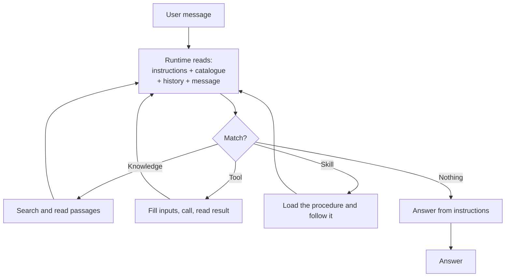

## TL;DR

Orchestration is how an agent decides what to do with a request: which knowledge to search, which tool,
skill, topic or other agent to use, whether to ask a question, and how to combine what comes back. The
runtime makes that choice by reading the **names and descriptions you wrote**. That is why descriptions
are the highest-leverage text in the whole product, and why "the agent won't use my tool" is almost
always a writing problem.

## Why it matters

Everything an agent does passes through this decision. An excellent tool that is never chosen is worth
nothing; a vague description that matches everything makes the agent worse at the things it used to do
well.

It also explains a pattern you will meet repeatedly: adding a capability degrades the ones already
there. Nothing broke. The decision just got harder.

## How it works

Each turn the runtime sees the instructions, a catalogue of everything it may choose from — every tool,
skill, knowledge source, topic and connected agent, by **name and description** — the conversation so
far, and the user's message. From that it decides. It may call something, read the result, and decide
again, several times before answering.

Microsoft is explicit about what drives the choice: **the most important factor is the description**,
followed by the name, the input and output parameters and *their* names and descriptions. Which means
you do not have to predict every phrasing a user might use — but you do have to say what a thing is for.

### Why descriptions are the logic

The runtime has no access to what a tool *does* — only to what you said it does. So:

> **Name:** `Run query` · **Description:** Runs a query against the database.

is unroutable. Nothing in it matches *"which revision should machining use?"*.

> **Name:** `Get released revision` · **Description:** Returns the current released revision of a part,
> drawing, controlled document or CNC program from Teamcenter, with the date and the ECN that introduced
> it. Use when the user asks which revision to use, whether something is up to date, or about revision
> history. **Do not use for work order status.**

is routable: it says what comes back, which words signal a match, and what it is not for. Microsoft's own
worked example does the same thing — a *Current Weather* description that ends "It doesn't get weather
forecasts for future days" — because that final clause is how two similar entries stay distinct. The
documented failure is precise: when several entries have similar descriptions the agent picks a single
one, and **which one becomes unpredictable**.

### One thing that varies by harness

The *principle* above holds everywhere. The *settings* do not.

<!-- volatile verified=2026-09 -->
On the **standard harness** you choose between **generative** orchestration, where the model selects from
descriptions, and **classic** orchestration, where a topic is triggered by matching trigger phrases.
Generative is the default for new agents, and the choice lives in the agent's **Generative AI** settings.
An administrator can turn generative orchestration off for a whole environment, after which agents there
can only use classic — one more thing to check rather than assume ({{topic:tenantvaries}}).

On the **GitHub Copilot harness** there is no such setting: the documentation states that this harness
uses its enhanced orchestration model for *all* agents. There is nothing to switch, and nothing to switch
off.
<!-- /volatile -->

Generative orchestration covers requests nobody enumerated, at the cost of being unable to say in advance
exactly what will happen. Classic matching is predictable and only covers what you listed. It can also
combine several entries in one turn, calling them in sequence and generating its own questions to fill
any inputs it is missing.

### History changes the decision

This one catches everybody, so it is worth stating on its own. The runtime uses recent conversation
history when deciding, which means **the same question can get a different answer in a fresh chat than in
a long-running one**. Microsoft names exactly this comparison — a new test conversation versus an ongoing
Teams thread — and calls the behaviour expected, because it is what lets an agent handle follow-ups.

The practical consequence: when you change something and it appears not to have worked, start a new chat
before concluding anything ({{topic:conversation}}). Changing the model can also change routing, so
re-test with the model the agent actually uses.

### The catalogue gets harder as it grows

Six well-described tools route well. Twenty overlapping ones route badly, and the failure is gradual:
slightly more wrong choices, on requests that used to work. The responses, in order of cost: sharpen
descriptions, add exclusions, merge or remove overlapping entries, and finally split the agent
({{topic:connected}}). Every entry also costs context on every turn, which is the other reason to keep
the list short ({{topic:contextcost}}).

## In practice at Technik

By the end of this level the assistant's catalogue holds five tools, two knowledge sources and a skill. A single question exercises most of the decision:

> *"Which CNC program revision should machining use for `P7000001042`, and is work order `100004513`
> using it?"*

The runtime has to call the revision tool, then reach work order data, then combine the two — and **not**
reach for the notification tool, the documents, or the write-up skill, all of which are about parts and
operations too. Work order `100004513` is one of the two that reference a superseded revision, so a
correct answer here is a genuine finding rather than a formality.

What makes that work is entirely text you wrote:

| Entry | The clause doing the work |
|---|---|
| `Get released revision` | "Use when the user asks which revision to use… **Do not use for work order status**" |
| Controlled Documents knowledge | "Released SOPs and work instructions… **Not for work order or QN status**" |
| `Find quality notifications` | "**Do not use to draft** or to change a notification" |
| QN write-up skill | "Use when the user has found a defect and wants it written up" |

Four exclusion clauses. Remove them and the same agent, with the same model and the same data, gets
noticeably worse — which is the most useful thing to know about orchestration.

> [!TIP]
> After adding anything to the catalogue, re-run the routing tests for everything already there. The new
> entry is not the only thing that changed; the decision changed for all of them.

## Design guidance

- **Write descriptions from real user phrasing**, not from the feature name.
- **Always say what an entry is not for.** Exclusions do more work than descriptions as you scale.
- **One entry per capability.** Overlap is the main cause of misrouting, and the documented result is an
  unpredictable pick rather than an error.
- **Keep the catalogue small.** Every entry costs context and makes the choice harder.
- **Test routing separately from output**, with should-trigger and should-not-trigger lists, and read the
  activity trace rather than inferring from answers ({{topic:test}}).
- **Start a new chat before judging a change**, and re-test after a model change.

## Pitfalls

| Symptom | Cause | Fix |
|---|---|---|
| A tool is never used | The description does not match how people ask | Rewrite it from real requests |
| The wrong tool is used | Two descriptions overlap, so the pick is unpredictable | Add exclusions; merge or remove |
| Adding a tool made the others worse | The decision got harder | Sharpen, prune, or split the agent |
| A fix looks like it did nothing | History from the old attempt is steering the decision | Start a new chat ({{topic:conversation}}) |
| Generative orchestration is unavailable | An admin turned it off for the environment | Check the environment, not the agent ({{topic:tenantvaries}}) |

## Key terms

**Orchestration** — deciding what the agent does with a request.

**Generative orchestration** — the model choosing from names and descriptions. A standard-harness setting;
the GitHub Copilot harness always reasons.

**Catalogue** — everything the runtime may choose from: tools, skills, knowledge, topics, other agents.

**Exclusion clause** — "do not use for…". The highest-value sentence in a description.

**Routing test** — should-trigger and should-not-trigger questions, run before checking output.
