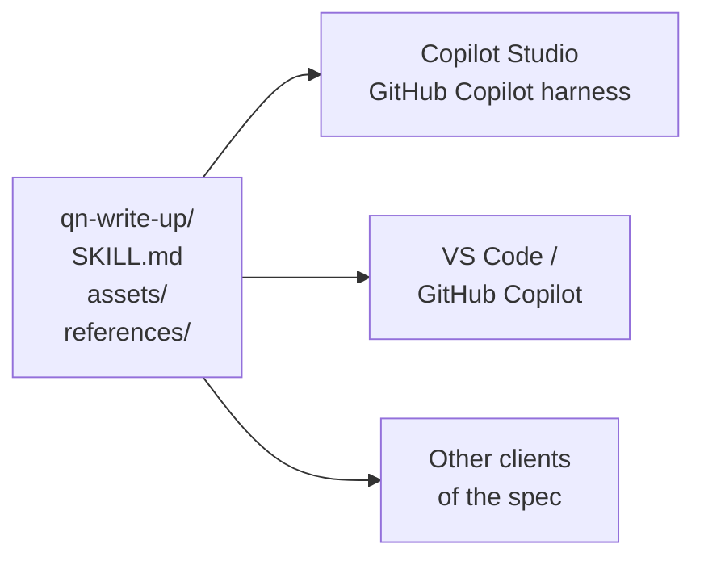

## TL;DR

A skill is not a Copilot Studio file format. It follows the **Agent Skills specification**, an open
standard that Anthropic originally developed and released, and that a long list of agent products now
read: GitHub Copilot, VS Code, Claude Code, Cursor, Gemini CLI, Codex and others. Copilot Studio's own
documentation says skills "follow an open specification". So the `SKILL.md` you write in this level is the
same artifact the Advanced level wields in an editor. What travels is the **format**. What does not
automatically travel is everything the skill *assumes*: the tools it names, and the limits of the harness it
was tested on.

## Why it matters

There are two reasons to care, one practical and one strategic.

**Practical: you are learning one skill, not two.** The Advanced level picks skills up again in VS Code and
GitHub Copilot ({{module:authoring-skills}}), and nothing you learn here is thrown away there. The anatomy,
the description discipline and the packaging rules are the specification's, not Copilot Studio's.

**Strategic: you are not writing into a proprietary box.** Most of what you configure in Copilot Studio
lives in Copilot Studio: a topic, for instance, has no meaning outside it. A skill is a folder
of Markdown and files that you can keep in source control, review in a pull request, and run in a different
product. When the procedure is Technik's, owned by a quality engineer rather than by whoever built the agent,
that difference decides who can maintain it.

## How it works

### The standard

The specification lives at agentskills.io. Its overview describes Agent Skills as "a lightweight, open
format for extending AI agent capabilities", originally developed by Anthropic, released as an open
standard, and open to contributions. It defines four things, and nothing about any one product:

- **A directory** with `SKILL.md` at its top, plus optional `scripts/`, `references/` and `assets/`.
- **The frontmatter**: two required fields, `name` and `description`, and four optional ones.
- **Progressive disclosure**: name and description at startup, the body on activation, files on demand
  ({{topic:skill}}).
- **File references**: relative paths from the skill's root, kept one level deep.

{{topic:skillmd}} takes each of those apart. The point here is that none of them is Microsoft's.

### Who reads it

The specification's overview lists dozens of clients. The ones a Technik engineer is likely to meet are
**GitHub Copilot** and **VS Code**, both Microsoft products, plus coding agents such as Claude Code and
Cursor. Copilot Studio's skills overview links the same specification and describes skills as portable
packages that follow it. Its own pages restate the specification's rules: the same naming rule for `name`
(lowercase letters, numbers and hyphens, no leading or trailing hyphen), and a `SKILL.md` with YAML
frontmatter in every package.

### What does not travel

Portable format is not the same as portable behaviour. Three things stay behind when a skill moves.

**The tools it names.** A skill that says *call `Find quality notifications`* works only in an agent that has
a tool by that name. In VS Code there is no such tool unless someone builds it — which is exactly what the
Advanced level's MCP server does ({{module:building-mcp-servers}}).

**The harness's own limits.** The specification allows a description up to 1,024 characters on several
lines; Copilot Studio skips a skill whose description is too long for its catalogue, and tells you to keep
it to a single line ({{topic:skillmd}}). A script that runs in one client's environment may fail in Copilot Studio's
sandbox, which has no network ({{topic:sandbox}}). A skill that works in one place has been tested in one
place.

**The optional fields.** The specification marks `allowed-tools` as experimental, with support varying
between products. It offers `compatibility` precisely so a skill can say what environment it expects.

<!-- unknown since=2026-10 -->
Copilot Studio's skills pages name only `name` and `description`. Whether the harness reads, ignores or
rejects the four optional fields (`license`, `compatibility`, `metadata`, `allowed-tools`) is not documented.
Keep them out of a skill you upload until it has been tested with them.
<!-- /unknown -->

## In practice at Technik

The `qn-write-up` skill is written once and kept in a Git repository owned by the quality team, next to the
documents it encodes. From that one folder:

| Where | What happens | What has to be true there |
|---|---|---|
| The Production Assistant, in Copilot Studio | Uploaded as a package; fires when someone asks for a write-up in Teams | The assistant has `Find quality notifications`; the description is one line |
| An engineer's VS Code, with GitHub Copilot | Read from the repository; drafts a write-up while they work on an incident report | Without the tool, the skill has to cope with the user pasting the QN details |
| A second agent, later | Uploaded again from the same folder | The same tool names, or the skill fails halfway |

The middle row is the one that shapes how the skill is written. If the body says *call `Find quality
notifications` and stop if it is not available*, the skill is useless in VS Code. If it says *get the QN's
history, from the notification tool if there is one, otherwise ask the user for it*, the same file works in
both places. Writing for portability is mostly writing the dependency as a fallback rather than as an
assumption.

## Design guidance

- **Keep the skill's source outside the agent**, in version control. The copy in Copilot Studio is a
  deployment, not the original.
- **Write to the strictest harness you deploy to.** If Copilot Studio wants a one-line description, every copy
  gets a one-line description.
- **Name tool dependencies in the body and say what to do without them.** A skill that degrades works in more
  places than one that assumes.
- **Test in each place it runs.** The format travels; the behaviour has to be checked.
- **Do not add optional fields for decoration.** Use `compatibility` when the skill really needs something,
  and leave the rest out until a harness documents them.

## Pitfalls

| Symptom | Cause | Fix |
|---|---|---|
| The skill works in VS Code and fails halfway in Copilot Studio, or the reverse | It assumes a tool one side does not have | Make the tool a fallback in the body; add the tool where it is needed |
| A skill from another product will not upload | It uses a multi-line description or optional fields the harness does not accept | Reduce it to `name` and a one-line `description`, then add back what is documented |
| Two copies of the write-up behave differently | They were edited in place, separately | One source in Git; redeploy from it |
| A bundled script works locally and fails in the agent | It needs network or a package the sandbox lacks | Check the sandbox's limits before writing scripts ({{topic:sandbox}}) |

## Key terms

**Agent Skills specification**: the open standard defining a skill's folder, frontmatter and loading model.

**Client**: a product that reads skills in that format, such as Copilot Studio, GitHub Copilot or VS Code.

**Portability**: the same files running in more than one client. The format guarantees it; the skill's
dependencies decide whether it works.
