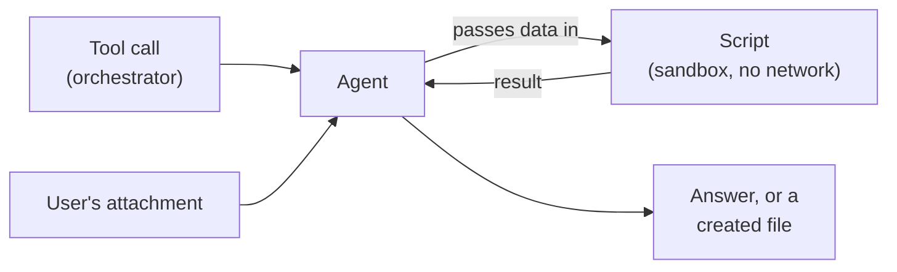

## TL;DR

A skill can bundle scripts in `scripts/`, and on the GitHub Copilot harness the agent runs them in a **sandbox**.
Two limits shape what belongs there: **no network** and **no installing packages**. So a script can import a
library and still fail on the first call that reaches out. Before writing any script, check whether the harness
already does the job: it creates Word, Excel, PowerPoint and PDF files natively, and scripting a spreadsheet it
would have produced anyway is the most common waste in a first skill. Whatever you do bundle, you read, because
you are responsible for code you ship, including code a model wrote.

## Why it matters

Scripts are the one part of a skill that is not instructions. A step says *do this*, and the model decides how.
A script does exactly what its code says, every time, which is the whole reason to bundle one. It is also why
scripts deserve suspicion. A script that cannot do what it claims fails at run time, in front of a user, and a
script nobody read can do things nobody intended with the files the agent was given.

The usual first mistake is not a dangerous script, though. It is a pointless one: two hundred lines of
`openpyxl` that produce the spreadsheet the agent would have produced if asked.

## How it works

### Check what the harness already does

Microsoft describes the GitHub Copilot harness as natively creating and editing Word, Excel, PowerPoint and PDF
files, and handing each one back as a download card with no configuration ({{topic:createdfiles}}). Ask for a
table *as a spreadsheet* and you get an `.xlsx`. The harness also runs each task in what Microsoft calls "a
secure sandbox governed by Copilot Studio".

So the first question for any script is: **would the agent do this anyway?** Formatting, layout and file type
almost never justify code. Put them in the skill's instructions or template, and let the harness write the file.

A script earns its place when the answer has to be **computed exactly**: a check over a hundred readings, a
calculation with a fixed rule, a transformation that must come out the same way every time. A model doing
arithmetic over long lists makes the mistakes a script cannot.

### What the sandbox allows

<!-- verified tenant=2026-09 -->
Scripts in a packaged skill's `scripts/` folder execute on this harness and return their output. The sandbox
measured was Python 3.12 on Linux, with `openpyxl`, `xlsxwriter`, `python-docx`, `python-pptx`, `reportlab`,
`pypdf`, `Pillow`, `pandas`, `numpy`, `matplotlib`, `requests`, `beautifulsoup4`, `lxml`, `PyYAML` and `jinja2`
present, and `fpdf` missing.
<!-- /verified -->

That list is one tenant at one moment; Microsoft publishes no package guarantee for this harness. Treat it as
*what was there*, not *what will be there*.

The two limits are documented for the same skill format in Microsoft 365 Copilot's declarative agents: **no
network access at runtime**, and a skill **cannot install packages at runtime**. The same page adds two rules
worth adopting: don't depend on a package unless its availability is confirmed, and scripts cannot reach
connectors, API plugins or MCP servers. The agent can, through the orchestrator.

<!-- unknown since=2026-10 -->
Copilot Studio's pages for the GitHub Copilot harness describe the sandbox only as secure and governed. That its
limits match the declarative-agent sandbox's is not documented. Design as if they do.
<!-- /unknown -->

The consequence is easy to miss: **availability is not usability**. `requests` imports cleanly, so a script that
fetches QN history from an API looks fine until it runs. Then the first call fails, because there is no network
to call over.

### Data in, file out

A script cannot fetch its own data, so the data has to reach it another way:



Tools fetch; scripts compute. That is the same division {{topic:skillsvs}} draws between a tool and a skill, one
level down.

### You own what you ship

Generate with AI writes a skill's "associated files" as well as its definition, and a skill from elsewhere can
bundle scripts too. Either way, a script in your
package is code your agent runs on your users' data. Before shipping one, read it all, and answer three
questions: what does it read, what does it write, and does anything in it try to reach the network? A script
you cannot explain is not ready to ship.

## In practice at Technik

An inspector attaches the ultrasonic thickness readings for the overlay on `XT-V2-1042`, a CSV with 140
measurement points, and asks whether the bore meets `SWI70000318`. Section 5 requires the finished overlay to be
not less than 3.0 mm **at every measurement point**.

That is a script's job. A model reading 140 rows can miss the one at 2.96 mm, and *every point* leaves no room
for nearly. So `qn-write-up` gains a script, and its body a step:

```markdown
3. If the user attached thickness readings, run scripts/check_readings.py on them with a
   minimum of 3.0. Quote every point it reports below the minimum, with its position.
   Do not round.
```

The script uses only the standard library's `csv` module, reads the attached file and prints the failing points.
It needs nothing installed and nothing from the network. The minimum comes from the work instruction, passed in
by the step, so a revision of `SWI70000318` changes one line of Markdown, not code.

Two scripts did **not** make it into the package:

| Proposed script | Why not |
|---|---|
| Build the QN write-up as a `.docx` | The harness writes Word files natively; the template already fixes the layout |
| Pull the work order's past QNs from SAP | No network in the sandbox; `Find quality notifications` already returns them |

## Design guidance

- **Ask whether the harness does it natively** before writing a line of code.
- **Script exact computation, not presentation.** Rules, counts, checks over long lists.
- **Pass data in from tools or attachments.** A script that fetches is a script that fails.
- **Prefer the standard library**, and rely on any other package only after testing that it is there.
- **Keep thresholds in the instructions**, citing their source, and pass them to the script.
- **Read every script you ship**, generated or not, and be able to say what it reads and writes.

## Pitfalls

| Symptom | Cause | Fix |
|---|---|---|
| The script imports fine and fails on its first request | No network in the sandbox | Fetch through a tool; pass the data to the script |
| *No module named …* | The package is not installed, and cannot be | Use one that is present, or the standard library |
| A script and the harness produce two different spreadsheets | The script duplicates native file creation | Delete the script; put the format in the template |
| A threshold is wrong after a document revision | It was hard-coded in the script | Keep it in the step, with the document number |
| The skill works in a tenant you tested and not another | It relied on a package one sandbox had | Re-test in each tenant; depend on less |
| Nobody can say what a bundled script does | It was generated or inherited unread | Read it before shipping, or remove it |

## Key terms

**Sandbox**: the isolated environment where the harness runs a skill's scripts.

**`scripts/`**: the skill folder for code the agent can run, loaded only when a step calls for it.

**Native file creation**: the GitHub Copilot harness producing Word, Excel, PowerPoint and PDF files without
code from you.

**Availability is not usability**: a package that imports can still fail, because the sandbox lacks what it
needs, such as a network.
