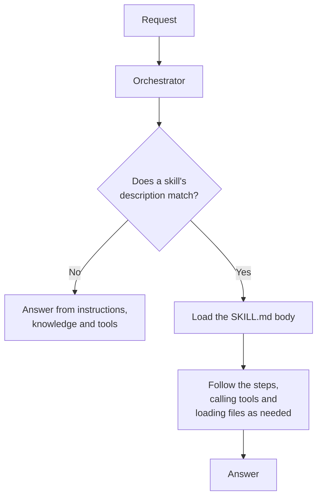

## TL;DR

A skill is know-how packaged as a file: a **name**, a **description** of what it does and when to use it,
and **instructions** in Markdown, optionally bundled with scripts, templates and reference material. The
runtime keeps only the name and description in view. When a request matches the description, it loads the
instructions and follows them. So a skill costs almost nothing until it fires, which is how an agent can
hold a lot of procedure without paying for all of it on every turn.

## Why it matters

Instructions are read on every turn ({{topic:instructions}}). Put Technik's QN write-up format in them and
every question carries it, including *what PPE do I need in coating?*, which has nothing to do with quality
notifications. Do that for four or five procedures and the instructions become thousands of tokens of
mostly irrelevant detail, re-sent with every message and competing with the rules that actually matter
({{topic:contextcost}}).

A skill turns that around. The procedure sits outside the instructions and costs one line until it is
needed. It is also a **file**: something a person can read, review, version and send to a colleague. A
procedure written into one agent's instructions has one copy and no history. A procedure written as a skill
can be added to several agents and owned by whoever owns the procedure.

## How it works

### What a skill is made of

Microsoft defines a skill as a capability with a name, a description and a set of Markdown instructions,
which can also bundle scripts, reference materials, templates and other resources. At minimum it is one
file, `SKILL.md`:

```markdown
---
name: qn-write-up
description: Drafts a quality notification write-up in Technik's format from a described defect. Use when someone has found a defect and wants it written up as a QN.
---

## Steps
1. ...
```

The block between the `---` lines is the **frontmatter**: what the runtime reads before it decides
anything. Everything after it is the **body**: the procedure the agent follows once it has decided.
{{topic:skillmd}} takes each part apart.

### Progressive disclosure

The format is built around one idea, which the specification calls **progressive disclosure**. A skill is
loaded in three stages, each paid for only when the one before it says so:

| Stage | What is in context | When |
|---|---|---|
| **Discovery** | `name` and `description` only, about 100 tokens | Always, for every skill the agent has |
| **Activation** | The whole `SKILL.md` body | When a request matches the description |
| **Resources** | A bundled template, reference file or script | When the instructions call for it |

Microsoft describes the same pattern: agents load "only the context they need, when they need it". The
consequence is the most important fact in this module: **the description is the whole activation
mechanism**. The runtime cannot read a body it has not loaded, so it decides from the description alone. A
precise description fires on the right requests; a vague one fires on the wrong ones, or never.



This is the same mechanism you met with tools ({{topic:tooldesc}}) and with orchestration in general
({{topic:orchestration}}), arriving for the third time. The runtime chooses from text you wrote.

### Skills work alongside tools

A skill does not replace a tool. Microsoft's distinction: tools connect to external services, while skills
are self-contained instructions and logic. A skill can tell the agent to use a particular tool in a
particular way. The QN write-up skill does not query SAP; it tells the agent to call the notification tool
for the work order's history, then write the draft its own way.

<!-- volatile verified=2026-10 -->
**Where skills exist.** Skills are a GitHub Copilot harness feature: every Microsoft skills page carries
that note, and the standard harness has no Skills area at all ({{topic:chooseharness}}, {{topic:reuse}}).
On that harness a skill is added from **Build** > **Skills** > **Add skill**, by uploading one, creating one
from blank, or generating one with AI. Microsoft also notes that building, testing and evaluating agents on
this harness may consume Copilot Credits.
<!-- /volatile -->

## In practice at Technik

The Technik Production Assistant's one skill is `qn-write-up`. It earns its place on every count that makes
something a skill rather than an instruction ({{topic:skillsvs}}):

| | The QN write-up |
|---|---|
| How often is it needed? | A few times a week, against hundreds of other questions |
| Is the *how* written down? | Yes: `SOP70000101` fixes what a write-up contains |
| Does the output have its own conventions? | Yes: fixed headings, the defect type, the operation, the criterion breached |
| Does it need bundled material? | Yes: a template, which the agent fills rather than reinvents |
| Does it need judgement? | Yes: which acceptance criterion the defect breaches, and how to word it |

Put in the instructions, that procedure would ride along with every work order status check. As a skill,
its description sits in the catalogue — *"Use when someone has found a defect and wants it written up"* —
and the body loads only when someone asks *"Write up the porosity on the overlay of `XT-V2-1042` as a QN."*

The last row matters too. A skill gives the agent a procedure and leaves it the judgement. If nothing in
the task needed judgement, if every write-up were identical, it would be a workflow instead
({{topic:triage}}).

## Design guidance

- **One skill, one kind of task.** Two narrow skills beat one that covers "quality stuff", because each
  description can then say exactly when it applies.
- **Write the description first.** If you cannot say in a sentence or two when the skill applies, the
  boundary is wrong, and no body will fix it.
- **Move bulk out of the instructions and into a skill**, not the other way round. Reference material that
  is needed sometimes is exactly what progressive disclosure is for.
- **Let the skill call tools.** A skill that tries to fetch its own data has swallowed a tool's job.
- **Treat the file as a document.** Review it, version it, and cite the procedure it encodes, so you know
  when that procedure's revision makes it stale.

## Pitfalls

| Symptom | Cause | Fix |
|---|---|---|
| The skill never fires | The description does not match how people ask | Rewrite the description from real requests; leave the body alone ({{topic:skillmd}}) |
| It fires on unrelated requests | The description is too broad, or overlaps a tool's | Narrow it, and say what it is not for |
| A just-added skill is ignored | Skills bind when a conversation starts | Open a new chat before deciding anything ({{topic:conversation}}) |
| There is no Skills area | The agent is on the standard harness | Reuse through other means ({{topic:reuse}}) |
| The write-up still follows last year's procedure | The SOP was revised; nothing linked it to the skill | Name the document and revision in the skill, and re-check when it changes |

## Key terms

**Skill**: a reusable capability made of a name, a description and Markdown instructions, with optional
bundled files.

**`SKILL.md`**: the file holding a skill's frontmatter and instructions.

**Progressive disclosure**: loading a skill in stages, so only its name and description are always in
context.

**Activation**: the runtime's decision, made from the description, to load a skill's body.
