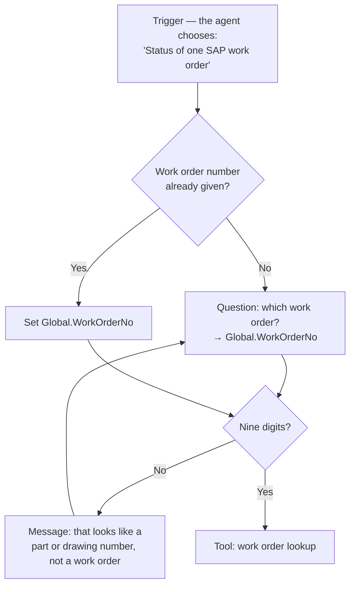

## TL;DR

On the **standard harness**, a topic is a conversation path you design node by node — messages, questions,
conditions, tool calls, redirects. The orchestrator picks it from its **description** under generative
orchestration, or from its **trigger phrases** under classic orchestration. Use one when an exchange must
run exactly as drawn: a structured intake, a compliance check, a confirmation before something
irreversible. The GitHub Copilot harness has no topics at all, which is the thing it gives up.

## Why it matters

Topics are the standard harness's guarantee. Instructions *influence*; a topic *runs*. When a work order
number has to be captured, checked and confirmed before anything uses it, a topic is how you know that
happened every time, rather than most times.

They are also the most over-used feature in Copilot Studio. Every question an agent answers inconsistently
looks like a candidate for a topic, and building one each time is how a flexible agent turns into a phone
menu. Knowing what a topic is *for* is how you tell the two apart — and, on the GitHub Copilot harness, how
you recognise the guarantee you have to put somewhere else.

## How it works

A topic is a portion of a conversation, drawn on an authoring canvas as a sequence of nodes:

| Node | Does |
|---|---|
| **Trigger** | Starts the topic |
| **Message** | Says something |
| **Question** | Asks, and stores the answer in a variable ({{topic:variables}}) |
| **Adaptive Card** | Shows an interactive card with buttons or fields |
| **Condition** | Branches on a value |
| **Variable management** | Sets, parses or clears variables — including the conversation history the agent uses |
| **Topic management** | Redirects to another topic, transfers to a person, or ends the topic or conversation |
| **Tool** | Calls a flow, a connector or another tool |
| **Advanced** | Generative answers, HTTP requests, events |

Topics can also take **inputs and outputs**, to pass values when one redirects to another. The code editor
shows every topic as YAML, which is the practical way to copy one between agents — though Microsoft does
not fully support designing a complex topic in the editor alone.

### How a topic gets chosen

This depends on the agent's orchestration setting ({{topic:genai}}):

- **Generative orchestration** — the default for new standard-harness agents. The orchestrator chooses
  among topics, tools and knowledge together, using each topic's **description**, and the trigger node shows
  *The agent chooses*. The description is therefore not a note to yourself: it is the routing signal, and
  it is written the way a tool description is ({{topic:orchestration}}). The orchestrator can also fill a
  topic's inputs from the conversation, asking for what is missing.
- **Classic orchestration** — each topic has **trigger phrases**, and natural language understanding
  matches the user's message to the closest topic. Phrases need not match exactly. Microsoft asks for
  **5 to 10** per topic, short rather than full sentences.

Switching an existing agent to generative orchestration makes Copilot Studio draft descriptions from the
existing trigger phrases. They are usually a fair start and always worth rewriting.

<!-- volatile verified=2026-09 -->
Three behaviours change under generative orchestration and are worth knowing before you rely on them: the
**Multiple Topics Matched** system topic is not called, so there is no built-in disambiguation; **custom
entities** cannot be topic inputs, so capture those values with a Question node instead; and an
administrator can turn generative orchestration off for a whole environment, leaving every agent in it on
classic.
<!-- /volatile -->

### System topics and custom topics

Every new agent starts with **system topics** — conversation start, escalation, fallback, end of
conversation and the like — and some predefined **custom topics** such as a greeting. You cannot create or
delete system topics, only turn them off or edit them — and Microsoft advises leaving them alone until you
are comfortable building complete conversations. The predefined custom topics you can edit or remove.

### When a topic is the wrong answer

If a topic is mostly conditions, it is a flow in disguise — call an agent flow instead
({{topic:topicsvsflows}}). If it is mostly messages, it is documentation; put it in knowledge. If it has to
cope with phrasing you cannot enumerate, it is the orchestrator's job, not yours.

## In practice at Technik

The Technik Production Assistant is on the GitHub Copilot harness, so **it has no topics**
({{topic:chooseharness}}). What follows is the standard-harness version of the one exchange it considered
guaranteeing — the design Technik would build if the assistant, or a second agent beside it, lived on the
standard harness.

A *Work order status* topic:

Three decisions in that small topic are the reason topics exist:

**It checks the format before anything uses the value.** `100004521` is a work order; `P7000001042` is a
part number typed into the wrong place. Caught here, every later step can trust the variable. An
instruction to check it would catch this *usually*; the Condition node catches it always.

**It stores the value globally.** The follow-up — *"which operation is it at?"* — should not ask for the
number again.

**It has a way out.** Left as drawn, a user who keeps typing part numbers loops forever. A real version
counts attempts and hands over after the third.

On the GitHub Copilot harness the same guarantee moves out of the conversation and into the lookup tool's
**input contract**: the tool rejects anything that is not nine digits and says why. That is the trade
{{topic:chooseharness}} records — the check still always happens, but at the point the value is used rather
than the point it is typed.

What would never be a topic on either harness: *"What does `SWI70000318` say about porosity?"* There is no
path to draw. That is knowledge.

## Design guidance

- **Build a topic when the path must be identical every time** — not because answers are inconsistent,
  which is usually an instructions or description problem.
- **Write descriptions like tool descriptions.** Under generative orchestration they are how the topic is
  chosen, and they should say when *not* to use it.
- **Validate captured values inside the topic.** It is the one place you can guarantee it.
- **Give every loop an exit.**
- **Keep topics short.** Many conditions means a flow.
- **Customise the fallback.** It is what users see at your agent's worst moment.
- **Avoid periods in topic names.** A solution containing such an agent cannot be exported.

## Pitfalls

| Symptom | Cause | Fix |
|---|---|---|
| There is no Topics area | The agent is on the GitHub Copilot harness | Put the guarantee in a tool's input contract or a flow |
| The wrong topic fires | Overlapping descriptions or trigger phrases | Make each boundary explicit; say when not to use it |
| A topic never fires | Its description or phrases do not match how people ask | Rewrite from real messages |
| Two topics matched and the agent picked one silently | Multiple Topics Matched is not called under generative orchestration | Sharpen the descriptions until they cannot both match |
| A custom entity will not bind as a topic input | Not supported under generative orchestration | Capture it with a Question node |
| The solution will not export | A topic name contains a period | Rename the topic |
| A topic has grown twenty conditions | It is a flow | Move the logic to an agent flow and call it |

## Key terms

**Topic** — a designed conversation path on the standard harness.

**Node** — one step of a topic: message, question, condition, tool call, redirect and so on.

**Trigger phrase** — an example of what a user says, used to choose a topic under classic orchestration.

**Topic description** — what the orchestrator reads to choose a topic under generative orchestration.

**System topic** — a built-in topic such as fallback or escalation; can be turned off, not deleted.

**Input contract** — what a tool accepts and rejects; where a GitHub Copilot harness agent puts the
guarantees a topic would have given.
