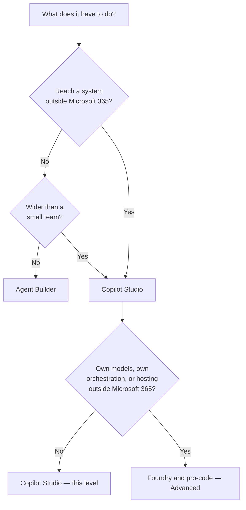

## TL;DR

Microsoft offers several places to build with AI, and they are not interchangeable: each has a
ceiling, and some of the choices are one-way doors. Three questions settle which surface you want —
**who uses it**, **how widely it ships**, and **what it has to do**. This level's answer is Copilot
Studio. Agent Builder is the floor beneath it and pro-code is the ceiling above, and knowing where
each stops is what stops you building the same thing twice.

## Why it matters

The expensive mistake is not choosing wrong. It is choosing without looking at the ceiling, getting
most of the way, and discovering the platform cannot do the one thing the requirement actually needed.

Two of these choices are hard to reverse. Copilot Studio's harness is fixed when you create the agent
and cannot be switched afterwards ({{topic:chooseharness}}). And moving between surfaces generally
means rebuilding — with one documented exception, which is worth knowing before you start rather
than after.

## How it works

### The map

<!-- volatile verified=2026-09 -->
| Surface | Who works here | What it is for | Where it stops |
|---|---|---|---|
| **Microsoft Copilot** (Chat, Word, Excel, Teams, Outlook) | Everyone | Using AI over your own work | Nothing is built here — this is Basic's territory |
| **Agent Builder** in Microsoft Copilot | Information workers | Lightweight question-and-answer agents over organisational content, authored in natural language | No actions into external services; individuals and small teams ({{topic:agentbuilder}}) |
| **Copilot Studio** | Makers and developers | Agents with connectors, multi-step logic, approvals, autonomous triggers, evaluation, environments and telemetry | Low-code: you configure an orchestrator you do not own |
| **Microsoft Foundry** | Engineers writing code | Your own models, your own orchestration, your own hosting | Everything is yours, including compliance and operations |
| **GitHub Copilot and VS Code** | Engineers | Your own tooling — and a second place the same Agent Skills run ({{topic:openformat}}) | Not where you publish an agent to colleagues |
| **Power Platform** (Power Automate, Power Apps, Dataverse) | Makers | Deterministic automation and data underneath an agent | No judgement: it runs what you designed ({{module:automation-and-workflows}}) |
| **Snowflake** | Data engineers | The governed data an agent queries — Technik's model lives here | Not a Microsoft product; reached through a connector |
<!-- /volatile -->

### The one distinction that explains the shape

Microsoft's documentation splits agents two ways, and it is the most useful cut on the whole map.

A **declarative agent** supplies instructions, knowledge and actions, and then uses *Copilot's own*
orchestrator and foundation models. Nothing extra is hosted, and the agent inherits Microsoft 365's
security, compliance and Responsible AI posture. Agent Builder produces these; so do pro-code tools
like the Microsoft 365 Agents Toolkit.

A **custom engine agent** brings its own orchestrator and its own models. It needs hosting, typically
in Azure and at additional cost, it can act proactively without a user starting the conversation, it
can talk to other agents — and you are responsible for its compliance and security rather than
inheriting them.

Copilot Studio sits deliberately across the seam: it is where a custom-engine agent can be built
without writing the engine.

### Choosing

The documentation names four factors: **audience**, **deployment scope**, **functionality** and
**governance needs**. In practice one requirement usually disqualifies a surface outright, so the
decision is a filter rather than a score.

Licensing follows the surface rather than leading it: Agent Builder and Copilot Studio are both
included with a Microsoft 365 Copilot licence, and without one you reach them through Copilot Credits
or pay-as-you-go. Agent Builder is also free for agents grounded on web content alone. The detail is
in {{topic:licensing}}, and it is worth reading before you commit, because capacity is the constraint
engineers actually hit.

### The one door that opens both ways

An agent built in Microsoft 365 Copilot can be **copied into Copilot Studio**, and its core
configuration and instructions come across intact. That makes Agent Builder a safe place to start
something you suspect will outgrow it. Note the direction: the documented path runs upward. Nothing
copies a Copilot Studio agent back down.

## In practice at Technik

Where does the Production Assistant belong? Take its requirements one at a time and let the hardest
one decide.

| Requirement | Consequence |
|---|---|
| Read work orders and revisions from Snowflake | An external system. Agent Builder is out on this line alone |
| Draft a document revision its owner submits for approval | A skill, and an approval flow with a named approver |
| Publish to a department in Teams | Beyond individuals and small teams |
| Be re-tested whenever instructions change | Needs evaluation |
| Move from a developer environment to production | Needs environments and solutions |

So: Copilot Studio, on the GitHub Copilot harness — because the guided build packages a capability as
a skill, and skills do not exist on the other two harnesses.

Advanced then rebuilds the same assistant in pro-code ({{module:pro-code-agents}}), and it is worth
being clear why. Not because Copilot Studio failed. Because the rebuild shows what changes hands: you
gain the orchestrator, the model choice and the deployment, and you inherit the evaluation harness,
the observability and the compliance work that Copilot Studio was doing for you
({{module:evaluation-and-observability}}).

## Design guidance

- **Let the hardest requirement pick the surface.** One disqualifying requirement beats five
  comfortable ones.
- **Check the ceiling before you start, not when you hit it.** Ten minutes on the comparison table
  saves a rebuild.
- **Prefer the lowest surface that genuinely holds the requirement.** Every level up costs you
  something the level below was doing for free — hosting, compliance, or both.
- **Name the one-way doors in your design.** Harness choice and platform choice, at least.
- **Do not choose by what you already know.** The reason to learn Copilot Studio is not that it is
  new; it is that an agent with connectors, environments and evaluation cannot live below it.
- **Write down which surface you rejected and why.** The next person will ask, and *"we tried Agent
  Builder and it cannot reach Snowflake"* is a much better answer than a shrug.

## Pitfalls

| Symptom | Cause | Fix |
|---|---|---|
| Built in Agent Builder, then needed an external system | Ceiling not checked against the hardest requirement | Copy the agent into Copilot Studio rather than starting again |
| The agent cannot be used where you expected | Channel limits differ per surface | Check the surface's channels before designing the rollout ({{topic:channels}}) |
| Skills are missing from the agent you created | The harness was chosen at creation and cannot be changed | Create a new agent on the right harness ({{topic:chooseharness}}) |
| Rebuilt in pro-code something the low-code surface already did | Chose by preference, not requirement | Re-read the requirement list; keep the rebuild for what actually needs it |
| A premium connector is unavailable | Building in the tenant's default environment | Build in your own developer environment ({{topic:devenv}}) |
| Two teams built the same agent on two surfaces | Nobody recorded the decision | Record the surface and the reason with the brief ({{topic:brief}}) |

## Key terms

**Declarative agent** — instructions, knowledge and actions on top of Copilot's own orchestrator and
models. No extra hosting; inherits Microsoft 365 compliance.

**Custom engine agent** — brings its own orchestrator and models, needs hosting, can act proactively
and talk to other agents, and owns its own compliance.

**Agent Builder** — the natural-language agent builder inside Microsoft Copilot
({{topic:agentbuilder}}).

**Copilot Studio** — the low-code platform for agents with connectors, environments and evaluation.
This level's build surface.

**Microsoft Foundry** — the pro-code surface for your own models and agents.

**Harness** — the runtime between what you build and the model; fixed when the agent is created
({{topic:harness}}).
