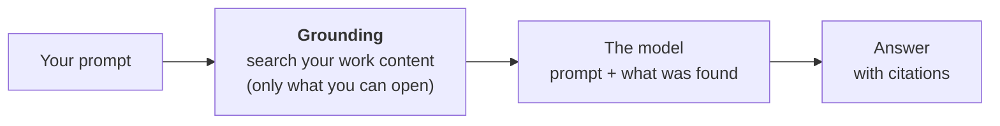

## TL;DR

Copilot doesn't only answer from what the model learnt in training. Before the model sees your
question, Copilot **searches your organisation's content** (documents, mail, chats and meetings) and
passes what it finds along with your message. That makes it useful at work, and changes how it goes
wrong: the typical mistake is no longer an invented fact but a **real sentence from the wrong
document**.

<!-- verified tenant=2026-10 -->
Signed in with your work account, Copilot does this search wherever you use it: in Chat, and in Word,
Excel, PowerPoint, Outlook and Teams. If answers that should know your documents never cite one, check
the setting at the end of *How it works*.
<!-- /verified -->

## Why it matters

A model that has never seen Technik's documents can only produce plausible text about them
({{topic:hallucination}}). Grounding puts the real documents in front of it, and Copilot does that
searching for you, every time.

That moves the risk rather than removing it. An answer built from your own files sounds authoritative
because it *is* quoting something real. The question stops being "did it make this up?" and becomes
"which document did this come from, and is it the right one?"

## How it works

Copilot **grounds** your prompt: it looks through your organisation's content in Microsoft 365 for
relevant material and adds it to the prompt. The model writes from both, and the answer comes back with
citations to what it used.

That search is not a plain keyword match. Microsoft builds a **semantic index** of your
organisation's content, which matches by meaning as well as by wording, so "cladding checks" can find
a document that only says "overlay inspection". That reach is also why it sometimes finds a document
*about* the right thing that isn't the right document.

Two limits shape the rest of this module: it only searches what you could already open
({{topic:visibility}}), and it only finds what was indexed ({{topic:missingcontent}}).

Microsoft states that prompts, responses and the content Copilot reads to answer them are not used to
train the underlying models.

<!-- verified tenant=2026-10 -->
In Copilot Chat, grounding in your work content can be switched off. Microsoft's
documentation calls it **Work IQ**. If an answer that should know your documents reads like a web
answer, check that setting first.
<!-- /verified -->

## In practice at Technik

You ask Copilot Chat:

> *What's the minimum overlay thickness on an XT valve body bore after cladding?*

Copilot finds two documents you can open: work instruction `SWI70000318`, a PDF in the Controlled
Documents library, and the *Weld Overlay Acceptance Criteria* summary table on the Technik Standards
site. Both mention overlay thickness.

Suppose the answer quotes the summary table and cites it correctly. Every word is real. But the
Standards page says **the work instruction governs where the two differ**, so the answer is only right
if the summary is up to date, and it can't tell you whether it is.

The fix is not a better question. It's reading the citation:

| You see | You do |
|---|---|
| A citation to the summary table | Open it, and notice that it defers to `SWI70000318` |
| A citation to `SWI70000318` | Check it's the released revision, then check section 5 says what the answer says |
| No citation at all | Treat the answer as ungrounded |

Asked against the work instruction itself, the answer you want reads: *finished overlay not less than
3.0 mm at every measurement point (`SWI70000318`, section 5).*

> [!IMPORTANT]
> A grounded answer is only as good as the document it found. Copilot can't tell a procedure from
> someone's summary of it.

## Using it well

- **Read the citations as part of the answer**: which document, which revision, which section.
- **Name the source when you know it.** *"According to `SWI70000318`…"* narrows the search to the
  document that governs.
- **Expect mail, chats and meeting notes in the results.** They're where outdated statements live.
- **When it found the wrong thing, say so in the next message.** *"Use the work instruction, not the
  summary page"* usually does it.

## Pitfalls

| Symptom | Cause | Fix |
|---|---|---|
| A confident answer with a real citation that's still wrong | It found a summary, an old copy or a chat, not the governing document | Open the citation; name the right document and ask again |
| Two colleagues get different answers to the same question | Each search only reaches what that person can open | Expected: compare citations, not answers |
| The answer reads like it came from the internet | Work grounding switched off, or a personal account | Turn work grounding on, sign in with your work account, or attach the document |

## Key terms

**Grounding**: finding relevant material and adding it to your prompt before the model answers.

**Semantic index**: Microsoft's index of your organisation's content, which matches by meaning as well
as by wording.

**Work content**: the documents, mail, chats and meetings in Microsoft 365 you can open.
