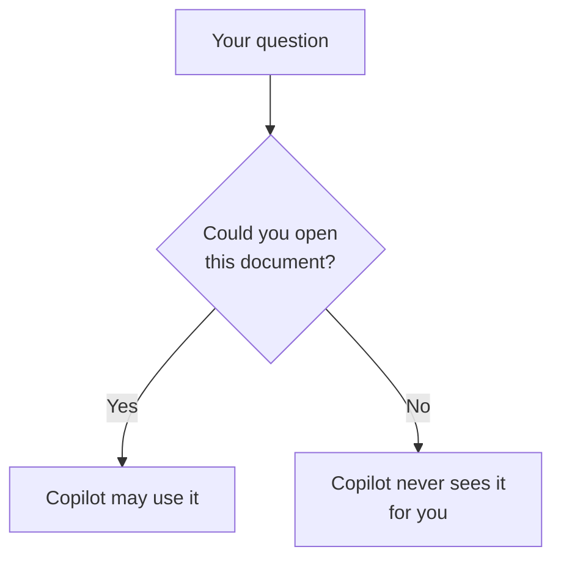

## TL;DR

Copilot works **inside your existing permissions**. It only reads content you could open yourself, so
it can't show you a document you'd be refused if you clicked the link, and using it never widens your
access. The other side of that rule matters as much: anything that is **over-shared** becomes far
easier to find, because Copilot searches it for you. Copilot doesn't create sharing mistakes. It
finds the ones that were always there.

## Why it matters

People worry about Copilot in two opposite ways. Some assume it can see everything. Others assume
that whatever it shows them must be meant for them. Both are wrong.

It sees what *you* can see. But "you can see it" and "it was meant for you" are not the same thing. A
folder shared with the whole company by mistake has always been open to you. You just never knew where
to look. Copilot does.

## How it works

Microsoft's rule is short: Copilot only surfaces organisational data that **you have at least view
permission to**, using the same access controls as the rest of Microsoft 365: site permissions,
sharing links, Teams membership, mailbox access. Every request is scoped to the person asking.

Three things follow.

**1. Two people, two answers.** You and a colleague in another team can ask the identical question and
get different answers, because each search only reached what that person can open. Neither answer is
broken. Compare the citations, not the wording.

**2. Absence is not evidence.** If Copilot doesn't mention a document, it may not exist, or it may sit
somewhere you have no access to. Copilot can't tell you which, because from your side the two look
identical.

**3. Over-sharing is found, not created.** If a site, folder or file is shared more widely than
intended, Copilot uses it like anything else you can open. Microsoft puts the responsibility where it
always was: on permissions set so the right people, and only they, have access.

Microsoft notes that the same applies to access given to people outside the company, for example
through a shared channel in Teams. Whatever is shared with them counts as theirs to open.

## In practice at Technik

### The draft you can't see

The engineering team is preparing revision C of work instruction `SWI70000318` in their own SharePoint
site. Production staff have no access to it, and the released revision B is published in the
Controlled Documents library, which everyone can read.

A production supervisor asks:

> *What does the latest version of SWI70000318 say about overlay thickness?*

Copilot answers from **revision B**: not less than 3.0 mm at every measurement point, section 5. The
draft never appears, and that is correct. The supervisor can't open the engineering site, so the
search never reached it. An engineer asking the same question might get an answer that mentions the
draft, from the same Copilot.

The citations show why. The supervisor's cites the released PDF. The engineer's cites a file in a
draft site, which should make them stop: a draft isn't the procedure.

### The draft everyone can see

Now suppose someone shared the engineering site with *everyone in the organisation*, to make one
review easier, and never undid it. The supervisor asks the same question, and this time Copilot quotes
the unreleased revision C, with a citation.

Nothing about Copilot changed. The access was always there. Copilot just found it.

> [!IMPORTANT]
> When Copilot shows you something you're surprised to have access to (a draft, a salary file, another
> team's investigation), don't use it, and don't forward it. Tell the site or file owner it's
> over-shared. That's the most useful thing Copilot can do for your organisation that day.

## Using it well

- **Check where a citation lives**, not just what it says. A file in a draft or personal folder is not
  a released document, however well it answers the question.
- **When an answer differs from a colleague's, compare citations.** The difference is usually access,
  not Copilot.
- **Don't read silence as "it doesn't exist".** Ask the document owner, or search the library you
  expect it in.
- **Report over-sharing when you find it.** Copilot makes it visible, and that's useful.

## Pitfalls

| Symptom | Cause | Fix |
|---|---|---|
| Copilot quotes a document you didn't know existed, and shouldn't see | Over-sharing that was always there | Don't use it; tell the owner |
| A colleague's answer cites a document yours doesn't | Different permissions | Expected; ask them for the document if you need it |
| You conclude no procedure exists because Copilot found none | It can only search what you can open | Ask the owner or check the library directly |

## Key terms

**Permissions**: who can open a file, site, chat or mailbox. Copilot inherits yours and never goes
beyond them.

**Over-sharing**: content shared more widely than intended, for example with everyone in the
organisation.

**Released document**: the approved version of a controlled document, as opposed to a draft.
