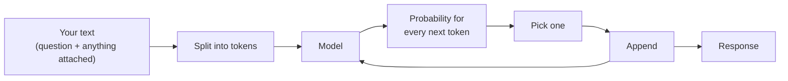

## TL;DR

A large language model, the engine inside Copilot, is trained on an enormous amount of text to do one
thing: given some text, predict what comes next. Everything Copilot does, from answering a question
to summarising a work instruction or drafting an email, is that one ability applied. The model has no
database, no memory between conversations, and no way of knowing whether what it writes is true. What
it has is an excellent sense of what *sounds* right. That makes it very useful, and it is exactly why
you still check its work.

## Why it matters

Nearly every surprising thing Copilot does follows from predicting the next piece of text:

- It answers differently the second time, because prediction is probabilistic.
- It invents a plausible document number, because a plausible document number is what comes next.
- It loses track of something said early in a long chat, because nothing persists unless sent again.
- It does better when you show it an example, because examples change what is likely to come next.

Keep "it predicts the next chunk of text" in mind and none of these are mysterious. Think of it as a
colleague who looks things up, and all four are baffling.

## How it works

**Training** shows the model vast amounts of text and repeatedly asks it to predict a hidden next
piece, adjusting it slightly each time it is wrong. A second stage, **instruction tuning**, uses
examples of good responses to turn a text continuer into something that behaves like an assistant.

**Generation** splits your text into small chunks called tokens. The model works out a probability for
every possible next chunk, picks one, adds it on, and runs again. The answer is built a piece at a
time, which is why Copilot's replies appear word by word.

Three consequences follow.

**It is stateless.** The model remembers nothing. A chat feels continuous only because Copilot sends
the conversation back to it each time.

**Its own knowledge is frozen and fuzzy.** It has never seen Technik's documents, and it cannot tell
something it knows well from something it half-absorbed from one bad web page.

**There is no fact-checking step.** A confident, well-formatted, completely wrong answer costs it no
more effort than a right one.

## In practice at Technik

Ask Copilot Chat, with nothing attached: *"Summarise quality notification 300001233."*

The model can write a well-structured summary of *a* quality notification. It cannot summarise *that*
one unless the notification is in front of it, so it generates a plausible one: right format, right
vocabulary, invented content.

When Copilot gets this right, it is because the real material reached the model: a document you had
open or attached, or content found for you. **Making sure it has the right material is the part you
control.**

> [!NOTE]
> This is why "which Copilot is smartest" is usually the wrong first question. A capable model with
> nothing to read will invent; an ordinary one with the right document will read it back correctly.

## Using it well

- **Don't rely on anything carrying over.** The model remembers nothing. If Copilot needs a fact, a
  file or a preference, give it in this conversation.
- **Treat what it "knows" as background, not a source.** It is excellent at language and structure,
  and no source at all for a Technik document number, procedure, status or date.
- **Separate "does it read well" from "is it right".** Copilot gives you no signal about which one you
  are looking at.
- **Check, don't re-ask.** For anything that must be exact, compare it with the source.

## Pitfalls

| Symptom | Cause | Fix |
|---|---|---|
| A confident answer about a Technik document gets the details wrong | Copilot never saw the document | Open or attach it and ask Copilot to answer from it. No rewording fixes this |
| It "forgot" what you told it yesterday | The model never remembers; any memory is a product feature built around it | Restate what matters in the chat you are in |
| Answers get worse as a chat grows | Earlier content is dropped, or the useful part is buried | See {{topic:context}}; start a new chat for a new task |
| The same question gives different answers | Sampling: normal behaviour, not a fault | Check against the source rather than re-asking until you like one |

## Key terms

**Large language model (LLM)**: a model trained to predict the next piece of text.

**Token**: the small chunk of text a model reads and writes, often part of a word.

**Stateless**: keeping nothing between requests. Any continuity comes from the application.

**Grounding**: putting trusted content in front of the model so it answers from that rather than from
memory. See {{topic:hallucination}}.
