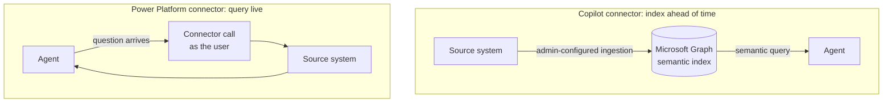

## TL;DR

Copilot Studio has two things called connectors that can both supply knowledge, and they work in opposite
ways. **Copilot connectors** (formerly Microsoft Graph connectors) *copy and index* external content into
Microsoft Graph ahead of time, where it is searched like any other Microsoft 365 content. **Power Platform
connectors used as knowledge** *query the source system live* when the question is asked, with the asking
user's own identity, and copy nothing. Pick on how fresh the answer must be and on whether the data may be
copied at all.

## Why it matters

Choose the wrong one and the agent works, but it is subtly wrong. Index content that changes by the hour,
and the answers trail reality. Query a system live for content that barely changes, and every question pays
for a round trip, every outage becomes your outage, and you have taken on a dependency for nothing.

The names do not help. "Connector" means two different things one menu apart. Knowing which is which is
most of this lesson.

## How it works

Microsoft's comparison page puts it as a mental model: Copilot connectors are "a search and index", and
Power Platform connectors are "live API bridges".

| | Copilot connector | Power Platform connector as knowledge |
|---|---|---|
| Data movement | **Yes.** Content is copied into Microsoft Graph, honouring the source's access control lists | **No.** Calls run at runtime, under the user's connection and identity |
| Who sets it up | An admin, in the Microsoft 365 admin center: connect, define the schema, apply semantic labels | Makers and admins, through Power Platform connections |
| Latency | Low; it is served from the index | Whatever the source system's API takes |
| Citations | Yes, built in | Not inherent; the agent can cite what it retrieved |
| Best for | Documents, knowledge bases, tickets, wikis | Up-to-the-minute facts, and data that must not be replicated |
| Governed by | Microsoft 365 licensing and an indexing quota | Power Platform data policies (DLP); standard or premium connector licensing |

<!-- volatile verified=2026-10 -->
Power Platform connectors as knowledge are a **preview** feature, documented for the **standard harness**,
which Microsoft says "might roll out by region or tenant". The supported list includes Salesforce,
ServiceNow, Azure SQL, Dataverse, Snowflake, Databricks, Oracle Database and SAP OData. For these, Microsoft
indexes **only metadata**, such as table and column names, and runs each request against the source system.
On the GitHub Copilot harness the **Add knowledge** dialog offers Salesforce, ServiceNow and Azure SQL among
its Featured sources, and Copilot connectors where the environment has them.
<!-- /volatile -->

### The permission question

This is where the two really differ.

A **Copilot connector** carries the source's access control lists into the index when it ingests the
content. If the mapping is faithful, users see only what they are entitled to see. If it is careless, you
have built a search engine that leaks, and the leak will not look like one, because every answer is
helpful and plausible.

A **Power Platform connector as knowledge** authenticates every runtime call with the asking user's token,
so the source system's own access controls apply. A user with no account in that system gets no answer.
That is unlike a connector **tool**, whose connection you can set up to run as the maker or a service
identity ({{topic:connauth}}). Knowledge does not give you that choice.

### Choosing

Ask, in this order:

1. **May the data be copied into Microsoft 365?** If not, an index is out, whatever else is true.
2. **How stale may the answer be?** If it must be current to the minute (an open ticket's status, today's
   priority), query live. If hours are fine, an index is faster and keeps working when the source is down.
3. **Does every user have an identity in the source system?** Live knowledge needs one per user. If they
   don't, it will answer nobody.

Microsoft's own rule of thumb: for "knowledge discovery and grounded Q&A at scale, start with Copilot
connectors"; for real-time grounding "without copying", use Power Platform connectors. Most organisations
end up with both, and Microsoft says one agent can use both.

## In practice at Technik

| Content | Choice | Reasoning |
|---|---|---|
| Controlled documents and standards | Neither: SharePoint knowledge directly | Already in Microsoft 365, already permissioned, already indexed |
| A supplier's public product documentation | A public website source, or a Copilot connector if an admin has one | Changes rarely and is not sensitive, so an index is fast and cheap |
| Work orders and operations in Snowflake | Neither, for the Production Assistant: a connector **tool** as `TECHNIK_AGENT_RO` ({{topic:tools}}) | Live knowledge would run as each user's own Snowflake identity, and most of the assistant's users have none |
| The plant maintenance team's ServiceNow knowledge base, if the assistant later needs it | A Copilot connector | Articles, not transactions; citations matter; an admin indexes it once |

The work order row deserves a closer look. Technik's SAP data is already replicated into Snowflake
**nightly**, so it is up to a day old before any agent sees it. Indexing it again on top would make answers
up to *two* days old while sounding just as confident. Staleness compounds quietly, and each layer looks
reasonable on its own. That is why the replica is queried live, by a tool, and not indexed a second time.

> [!IMPORTANT]
> Whenever an agent answers from an indexed or replicated source, say how fresh it is in the agent's
> description and its instructions: *"Work order data is as of last night's refresh."* Users can act on
> that sentence. They cannot act on silence.

## Design guidance

- **Decide whether the data may be copied first.** It rules options out before freshness does.
- **Never index content whose permissions you cannot map faithfully.** A leak through search is still a
  leak.
- **Do not layer staleness.** If the source is already a nightly replica, an index doubles the lag.
- **Check every user has an identity in the source** before choosing live knowledge.
- **Treat preview features as preview.** Microsoft says they are not meant for production use.
- **Plan for the source being down.** With a live query, its outage is your outage.

## Pitfalls

| Symptom | Cause | Fix |
|---|---|---|
| Answers are right but a day behind | An index or replica answering from its last refresh | Query live, or state the refresh time plainly |
| A user sees content they should not | Access control lists were not carried into the index | Fix the mapping; remove the source until it is fixed |
| Live knowledge answers the maker and nobody else | Users have no account in the source system | Give them one, or use a tool with a service identity |
| The Graph connection does not appear in Copilot Studio | No admin has created the connector in the tenant | Ask an admin, then add it under **Add knowledge → Advanced** |
| Real-time knowledge is missing from the dialog | Preview, rolling out by region or tenant, or a different harness | Check the harness and the tenant before designing around it |

## Key terms

**Copilot connector** — indexes external content into Microsoft Graph ahead of time. Formerly called a
Microsoft Graph connector.

**Power Platform connector as knowledge** — queries the source system live, as the asking user. Preview.

**Real-time knowledge** — Microsoft's name for the live, no-copy option.

**Access control list (ACL)** — the source's record of who may see an item, carried into an index.

**Staleness** — how far behind reality an answer may be. It compounds across layers.
