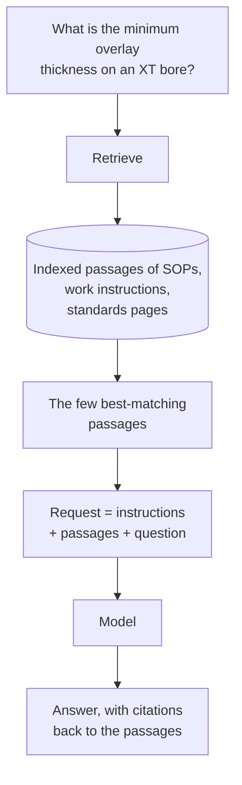

## TL;DR

Retrieval-augmented generation (RAG) is two steps. **Retrieve**: find the passages of your content most
likely to answer the question. **Generate**: put those passages into the request and have the model answer
from them. That is how an agent answers from Technik's documents without the model ever being trained on
them, and it is what happens behind every knowledge source in Copilot Studio. RAG makes a right answer far
more likely. It does not guarantee one: whatever was retrieved, and whatever wasn't, shapes the answer.

## Why it matters

{{topic:hallucination}} set out the problem. A model asked about content it has never seen produces a
plausible answer, not an empty one. RAG fixes the cause rather than the symptom. With the real clause of
`SWI70000318` in the context, quoting it becomes much more likely than inventing one.

It is also the cheapest fix there is. Nothing is retrained, no model changes, and when a document is revised
the agent can answer from the new revision as soon as it has been indexed. Compare fine-tuning
({{topic:training}}), which is a retraining project and still gives you no citations.

Knowing how RAG works matters because most knowledge failures are retrieval failures that look like model
failures. An agent that quotes the wrong clause usually received the wrong clause. If you understand the
pipeline, you look in the right place first.

## How it works

Microsoft's Azure AI Search documentation describes the same pipeline in more detail than Copilot Studio
does, and it names the problems each stage solves.

**Chunking.** Documents are split into passages before indexing, so that a part can be matched on its own.
Retrieving a whole nine-page work instruction would fill the context with mostly irrelevant text. Where the
splits fall matters: a chunk that cuts a table in half retrieves badly. In Copilot Studio you do not control
chunking; {{topic:chunking}} does.

**Indexing.** Each chunk is stored so it can be found again: by keyword, by meaning (a vector embedding),
or both. Meaning-based search is what lets *"how thick does the cladding need to be"* find a passage
that says *"finished overlay thickness shall be not less than 3.0 mm"*, with barely a word in common.
Combining the two, called hybrid search, catches what each misses alone. Exact identifiers such as
`SWI70000318` are where keyword search earns its place.

**Retrieval.** The question is matched against the index and the best few chunks come back. *Few* matters.
Microsoft frames it as a token constraint: return "highly relevant, concise results — not exhaustive
document dumps". For SharePoint knowledge in Copilot Studio, Microsoft's troubleshooting page says how few:
it uses **only the top three search results** to generate a response.

**Generation.** The chunks go into the request alongside the instructions and the question, and the model
writes its answer from them. A citation is the record of which chunk a statement came from.

### A newer variant: agentic retrieval

Azure AI Search now recommends *agentic retrieval* for new work. A model breaks a complex question into
several focused sub-queries, runs them in parallel across sources and merges the results. It is the
engine behind Foundry IQ ({{topic:workiq}}), and {{topic:agentic}} covers it. The two steps are the same;
only the retrieve step has become smarter.

### What RAG does not fix

- **It does not make the answer right.** The model can still misread a passage it was given.
- **It does not fill a gap in the content.** If no document covers the question, retrieval returns the
  nearest thing, and the nearest thing is where blending starts.
- **It does not choose between sources that disagree.** Retrieval hands over whatever matched. Which source
  governs is something you write into the instructions.
- **It does not make bad content good.** A procedure with no headings and vague titles retrieves badly and
  answers badly.

## In practice at Technik

A quality engineer asks the Technik Production Assistant:

> *"What is the minimum overlay thickness on an XT valve body bore, and why that figure?"*

Retrieval finds passages in three places, because all three are relevant:

| Source | Passage | What it contributes |
|---|---|---|
| `SWI70000318` §5 | Finished overlay not less than 3.0 mm at every measurement point | The requirement |
| `DGL70000009` §3 | 0.5 mm dilution + 1.0 mm machining allowance + 1.5 mm service allowance | The reason |
| *Weld Overlay Acceptance Criteria* (standards site) | A summary table, and "where this page and the work instruction differ, the work instruction governs" | The precedence |

A good answer takes the number from the work instruction and the reasoning from the design guidelines, and
cites both. The retrieval did not find *the* document. It found three, and the answer was assembled from
them.

Now look ahead. `ECN70000042` is released, and revision C of `SWI70000318` is waiting to be written. When
it lands with new criteria, nobody will update the standards page automatically. Retrieval will keep
returning the stale summary alongside the current instruction, because it still matches the question
well. Nothing errors.

> [!IMPORTANT]
> The most dangerous knowledge failure is not a missing document. It is a retrievable one that is out of
> date. The defence is an instruction saying which source governs ({{topic:citations}}), plus the habit
> of retiring a summary when the thing it summarises changes.

Then ask the question {{topic:genai}} promised: *"What is the minimum overlay thickness for Inconel on a
manifold header?"* `SWI70000318` covers XT bores, not manifold headers, but it is the closest match, so it
is retrieved anyway. The only acceptable answer is that the sources don't cover it. Watch for a confident
3.0 mm instead.

## Design guidance

- **Fewer, better sources.** Every source you add gives retrieval more chances to return something
  irrelevant into a window of about three results.
- **Prefer the governing document over a summary of it**, and where you keep both, say which wins.
- **Write content that retrieves well**: real headings, one idea per section, descriptive titles, and the
  words users actually type.
- **Instruct the agent to answer only from its sources** and to say when they do not cover the question. On
  the GitHub Copilot harness nothing else enforces this.
- **Test with questions the content does not answer**, not only with ones it does.

## Pitfalls

| Symptom | Cause | Fix |
|---|---|---|
| Confident answers with no citations | Nothing was retrieved and the agent answered anyway | Instruct it to cite and to abstain; check the activity trace for a Knowledge step |
| Answers got worse after adding a source | Irrelevant passages now compete for a handful of slots | Remove or narrow the source; sharpen its description |
| The right document, the wrong clause | Retrieval returned a neighbouring chunk | Check what was retrieved; improve headings in the source |
| A stale summary quoted as current | It still matches the question well | State source precedence; retire summaries when their source changes |
| An answer about a case the documents do not cover | The nearest passage was retrieved and stretched | Abstention instruction, and a test case that asks exactly this |

## Key terms

**Retrieval-augmented generation (RAG)** — finding relevant content and adding it to the request so the
model answers from it.

**Chunk** — one passage of a document, as indexed and retrieved.

**Hybrid search** — keyword and meaning-based (vector) search run together, with results merged.

**Agentic retrieval** — a model plans several sub-queries, runs them in parallel and merges the results.

**Grounding** — answering from supplied content rather than from what the model learned in training.

**Abstention** — declining to answer when the sources do not cover the question. It has to be asked for.
