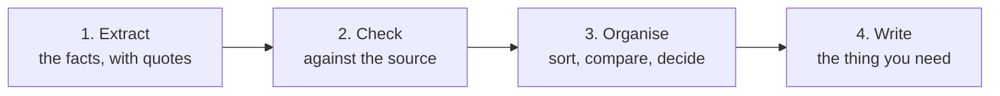

## TL;DR

A long request that asks for several things at once gets an answer whose mistakes are hidden inside it.
Split the job into ordered steps (pull out the facts, then sort them, then write) and ask for one step at a
time. Check each result before you build on it. Each step is small enough to check, and a mistake caught at
step one never reaches the email at step four.

## Why it matters

One long prompt feels efficient. The answer comes back in one piece, fluent throughout, and you can't see
which part rests on what. If the message to the planner contains a date, did it come from the QN, or was
it filled in because such messages usually have one?

Microsoft's prompt guidance says models often perform better when a task is broken into smaller steps,
and that the difference grows with the size of the material. Splitting also makes the result checkable.

## How it works

Most document jobs have the same underlying order:

**Extract first.** Ask for the facts as a plain list, each with the sentence it came from. This is the step
where invention is easiest to catch, because a fact with no matching sentence stands out.

**Check before moving on.** Read the list against the source. Fix it in the chat (*"item 3 isn't in the QN,
remove it"*) before anything is built on it.

**Then organise.** Group, compare or pick out what matters, working from the checked list, not the original
document.

**Write last.** By now the facts are settled; this step only phrases them.

This works in one conversation, because each step's result stays in front of the model for the next
({{topic:context}}). Keep the conversation on this one job. When you move on to something unrelated, start
a new chat.

## In practice at Technik

You need two things about quality notification `300001234`: a summary for the morning meeting and a short
message to the planner whose schedule the held unit affects.

**All at once:**

> Read this QN, work out what's still open, summarise it for the team leads and draft a Teams message to
> the planner.

The message says the unit *"should be released by Thursday once the disposition is complete"*. The QN gives
no date at all. Thursday is a plausible completion, written because messages like this usually carry one,
and nothing in the reply shows where it came from.

**In steps, in one chat:**

1. *"List every fact the QN text below states, one per line, each followed by the sentence it came from.
   List nothing that isn't in the text."* You read eight lines against the QN. All eight are there, and none
   gives a date.
2. *"From that list only, which items are still open, and does the QN say who owns each one?"* Two items:
   the disposition, owned by the quality engineer, and the unit's release, with no owner stated.
3. *"Write the meeting summary from the checked list, using the headings Found, Where, Done so far, Still
   open, Not stated."* ({{topic:output}})
4. *"Draft a three-line Teams message to the planner: the unit is held at cladding, the disposition is
   pending, and no release date is set yet."*

Step 4's message now *says* there is no date, the one thing the planner most needed to hear. The check
in step 1 is what made the rest safe.

> [!NOTE]
> Asking Copilot to *show its reasoning* in one long answer isn't the same thing. You still get one block
> to audit. Separate requests give you separate results, each one checked before the next.

## Using it well

- **Extract with quotes first** for anything you'll act on.
- **One step per message.** Read each answer before sending the next.
- **Correct in place.** Fix a wrong step in the chat before building on it.
- **Tell later steps what to work from**: *"from that list only"*.
- **Keep the chat to one job**, and start fresh for the next.
- **Save the steps** that worked as a sequence you can reuse ({{topic:iterate}}).

## Pitfalls

| Symptom | Cause | Fix |
|---|---|---|
| A specific detail in the final draft that no source contains | Everything was asked at once, and gaps were filled | Extract facts with quotes first; build only on the checked list |
| A later step contradicts an earlier one | It went back to the document, not to your checked list | Say *"from that list only"* |
| Splitting made it worse late in the chat | The chat ran long, or had been on another task | Start a new chat for the job and run the steps there |
| The steps feel slow for a small job | Not every job needs them | Split when the answer will be acted on, or the source is long |

## Key terms

**Decomposition**: splitting a task into ordered steps, each asked and checked separately.

**Extraction step**: the first step, which lists facts from the source with the sentence each came from.
