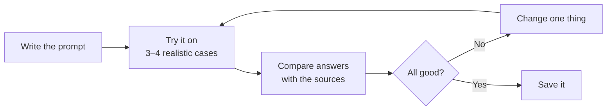

## TL;DR

A good prompt is rarely right first time. Write it, try it on a few realistic cases, compare the answers,
change one thing, and try again. Most of the gain comes from the second and third versions. Once a prompt
holds up, save it where you and your team can find it, because a prompt you use every week is worth more
than a clever one you used once.

## Why it matters

A prompt that worked once has been tested once. The same prompt can give a different answer next time,
because the output carries some randomness ({{topic:llm}}). And the next document can be different in ways
the first wasn't: shorter, messier, or missing the very thing you asked about. Microsoft's own guidance
warns that a carefully crafted prompt working well in one case doesn't mean it will hold up more broadly.

## How it works

There are two kinds of iteration, and they fix different things.

**Following up in the chat** fixes *this answer*: *"shorter"*, *"you left out the serial number"*. It's
the quickest repair, and it changes nothing about next week's answer.

**Revising the prompt** fixes *every future answer*. That is the one worth doing for anything you'll run
again:

Three habits make the loop work:

- **Choose cases that differ.** One typical case, one that's tricky in a way you expect, one where the
  source lacks what you asked for. A prompt is only as good as its worst case.
- **Change one thing at a time.** Change three and you won't know which helped, or which broke another
  case.
- **Run each case more than once** when the answers matter, so you can tell a real improvement from
  ordinary variation between runs.

## In practice at Technik

The summary prompt from the rest of this module (audience, source, the five headings, *"not stated"*) has
worked well on quality notification `300001234`. Before you hand it to other supervisors, try it on three
more:

| Case | Why this one | What happened |
|---|---|---|
| `300001234` | The typical case | Good |
| `300001211` and `300001219`, one at a time | Near-duplicates: the same porosity, raised twice | Good, but the two summaries read identically, and nothing says they may be the same problem |
| A QN whose description is one line | The source lacks most of what's asked | *Done so far* says *"Area marked and unit held pending disposition"*. The QN says neither |

The third case is the find. *Done so far* invites the usual steps, and a one-line QN gives nothing to stop
it. **Change one thing:** add *"Under Done so far, write only actions the QN records.
If it records none, write 'none recorded'."* Run all four again. The one-line QN now says *none recorded*,
and the other three are unchanged.

The near-duplicates suggest a second change. One change per round, so note it for later.

Then save it.

<!-- verified tenant=2026-10 -->
In Copilot Chat, a prompt you've sent can be saved to **Prompt Lab** with the bookmark icon next to it. On
some devices you hover over the prompt to see it. Saved prompts appear under **Your prompts**, and the
**Share prompt** icon shares one with a team, where it appears under **Team prompts**. A saved prompt can't
be edited in place. To change one, run it, edit it in the chat box, save it as new, and delete the old one.
<!-- /verified -->

Keep a note beside a shared prompt of what each change was for. The next person to improve it needs to
know *none recorded* was deliberate.

## Using it well

- **Test on 3–4 different cases**, including one where the source lacks what you ask for.
- **Change one thing per round**, and re-run every case.
- **Follow up for one answer; revise the prompt for the next hundred.**
- **Save prompts that hold up**, with a note of what each change was for.
- **Re-test a saved prompt now and then.** The model behind Copilot changes, and a prompt that held up
  last quarter may not now.

The same habit becomes a test set when you build an agent: {{module:testing-and-evaluation}}.

## Pitfalls

| Symptom | Cause | Fix |
|---|---|---|
| A prompt that "worked" fails on the next document | It was tested on one case | Try 3–4 cases that differ, including a thin one |
| After several edits, you can't tell what helped | Several things changed at once | One change per round; re-run all cases |
| Different answers on the same document | Ordinary variation between runs | Run important cases twice; tighten the format and the out |
| A good fix keeps getting lost | It lived in one chat as a follow-up | Fold it into the prompt itself and save that |

## Key terms

**Iteration**: revising a prompt, trying it on several cases and comparing the answers.

**Test case**: a realistic input you use to check whether a prompt holds up.

**Prompt Lab**: the place in Copilot Chat where saved, shared and suggested prompts live.
